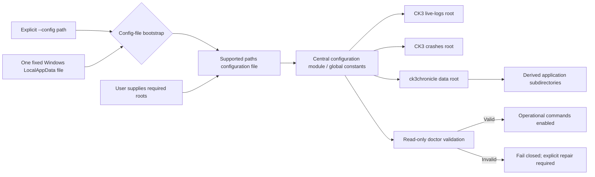
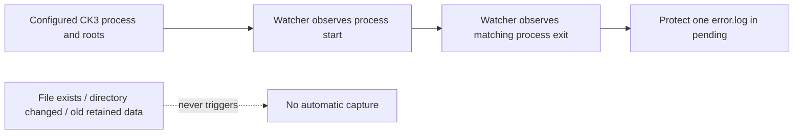
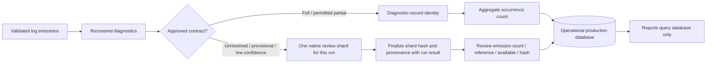
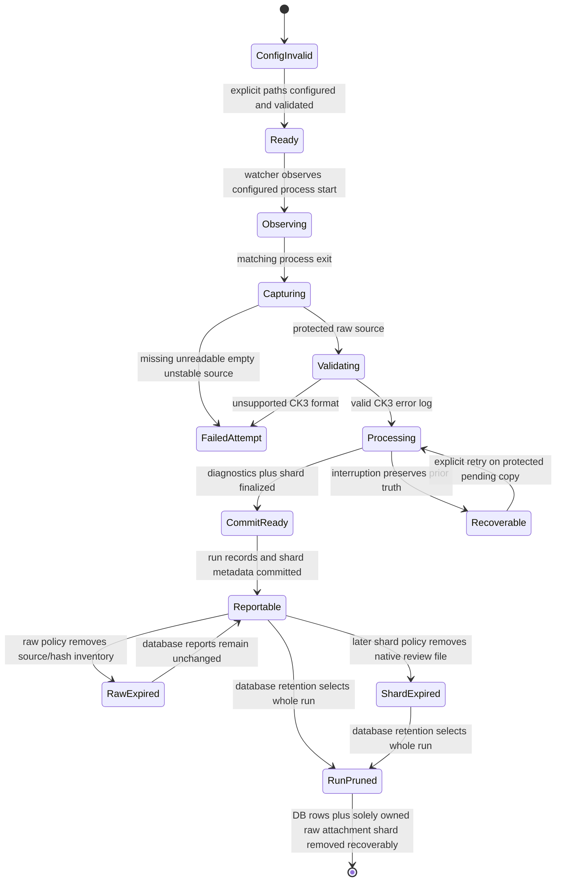

# Architecture and data lineage

Status: active target architecture as of 2026-08-31.

## Recommendation

Evolve the canonical standalone package and SQLite database in place. Add one
explicit configuration authority, lifecycle-gated capture, a finite retained-
raw hash inventory, compact diagnostic records, and exactly one native review
shard per successfully processed run.

This is not a rewrite, greenfield database, content-addressed evidence system,
or service decomposition. Implementation proceeds incrementally through the
named milestone plan.

## Explicit configured-root architecture



`--config <path>` opens exactly the supplied file. Without the option, the
only location is the application-owned Windows LocalAppData
`ck3chronicle/paths.toml` path. The bootstrap never searches for another
configuration filename or legacy location.

No edge enters the central configuration from filesystem scanning, Windows
registry, Steam libraries, Documents conventions, environment guesses, sibling
repositories, or fallback defaults. A later milestone adds a root only through
the same explicit configuration authority.

## Lifecycle-triggered capture



One observed start-to-exit lifecycle triggers one copy. No observed lifecycle
means no automatic capture. An explicit manual/recovery capture enters the
capture service separately and may leave lifecycle start/exit unknown.
Deferred ingestion stores the full-file `error.log` SHA-256 with the Run ID and
rejects an existing hash before parsing or creating another Run ID.

## Per-run review-shard architecture



Every successfully processed run has one finalized shard, even when it is
empty. The shard is separate from both the complete raw `error.log` and compact
approved diagnostic records. The database never claims an available shard
that was not safely published.

## Responsibility boundaries

| Component | Owns | Must not own/do |
|---|---|---|
| Configuration bootstrap | Open exact `--config` file or the one fixed LocalAppData `ck3chronicle/paths.toml` file | Probe alternate names/locations, search, or fall back after failure |
| Configuration module | Parse/validate the explicit paths file; expose all operational roots/constants; derive application subdirectories | Search, registry probing, conventional fallbacks, duplicated hardcoded root logic |
| Read-only `doctor` | Configuration syntax/keys/type/existence/access, live-logs/crashes/data/database/model/retention readiness | Require a current `error.log` for base/watch readiness; validate an explicit manual input instead of its operation; mutate, repair, initialize, or discover paths |
| Lifecycle watcher | Configured process start/exit and one copy attempt after exit | Capture from file presence/directory change/polling; hash, parse, or access SQLite |
| Capture service | Copy-first live-root `error.log`, complete pending publication | Database/parse work before protection; crash-folder principal access |
| Raw-source store | Raw path/size/time while policy retains the source | Run identity or ingestion policy |
| Run registration | Run identity/chronology and durable `error.log` content hash metadata | Parse/classify source or accept an existing hash |
| Input boundary | Configured Paradox-managed live source and explicit missing/unreadable/unstable/empty failure | Adversarial validation of fabricated CK3-owned directory contents |
| Emission recognizer | Timestamp-header/continuation boundaries and counters | Semantic contract choice or path discovery |
| Source-specific splitter | Reviewed multi-error grammar and exact child recovery | Generic long-message guessing or permanent parent-emission schema |
| Classifier/aggregation | Approved contracts/slots and diagnostic-record identity/counts | Confident storage of uncertain payload |
| Native review shard service | One per-run substantially native shard, provenance, hash, finalization, inspect/export, FIFO retention | Diagnostic authority, raw-log replacement, unlimited storage, payload duplication in SQLite |
| Database repositories | Runs, diagnostic records, lineage, counters, review metadata, retention/audit state | Full review payload, raw-log report dependency, mandatory saved report copies |
| Report/query service | Deterministic database-only human/structured reports | Opening raw logs, parsing, model execution, routine result persistence |

## Data authority and mutability

| Data | Authority | Mutability/retention rule |
|---|---|---|
| Operational roots | User paths file through central configuration | Explicit user repair/change only; no inferred fallback. |
| Observed lifecycle | Watcher event metadata stored with its accepted Run ID | Observation remains metadata; it is not a separate product identity. |
| Manual/recovery capture | Explicit capture attempt, mode, capture time, and requested input | Successful processing receives a Run ID; unobserved lifecycle facts remain unknown. |
| Exact raw `error.log` | Protected live-root capture | Never rewritten; default one week. |
| `error.log` content hash | Successful Run ID metadata | Durable light-touch duplicate/integrity guard; survives raw expiry and is never compared to a crash copy. |
| Failed input attempt | Operational failure log | Never appears as a successful diagnostic run. |
| Log emission/recovered diagnostic | Transient parser pipeline unit | Stored compactly only after approved classification or routed to shard. |
| Diagnostic record | Approved meaning-bearing identity within one run | Equal identity increments occurrence count. |
| Native review shard | One per successful run | Append during processing, finalize atomically, then immutable; FIFO age/size pruning. |
| Review metadata | SQLite emission-count/reference/availability/hash | Updated transactionally with shard finalization/deletion. |
| Report | Database query result | Never depends on raw source; not durable by default. |

## Diagnostic-record identity gate

Before schema migration, approve contract/revision, typed-slot, relevant
file/line/symbol/locator, normalization, volatile-field, collision, and version
rules. One approved multi-error fixture must prove `N` distinct identities
produce `N` records; another must prove `N` clauses with one identity aggregate
to one record with count `N`.

## Review-shard physical design

Approved shape:

```text
review/
  <run_id>/
    review.error.log[.gz]
    review-manifest.json
```

The native file preserves routed emissions/order/frequency. The sidecar records
run ID, source-family counts, application/parser/splitter/model revisions,
routing reasons/confidence states, emission counts, finalization state, and whole-
shard hash. Lossless compression may follow finalization.

SQLite stores conceptually `review_emission_count`, `review_shard_reference`,
`review_shard_available`, and `review_shard_hash`, not the native payload.

Owner-accepted measurement candidate, not an active default: **90 days and
2 GiB, whichever triggers FIFO deletion first**. Measure representative
per-run/per-day shard growth, percentiles, unknown-heavy workloads, compression,
and simulated occupancy before a later default decision. The candidate duration
is materially longer than the one-week raw-log default.

## Transaction/state model



No native review shard silently outlives a deleted database run. The only
exception is an explicit export/promotion into a separately governed learner
corpus, which is no longer the run-owned shard.

## Current implementation evidence

- Watcher/capture, hashing, capture metadata, SQLite/migrations, emission parsing,
  persistent-reader splitting, classification, and database reports are useful
  foundations.
- The input boundary must reject an existing `error.log` hash and zero-byte
  source before creating a Run ID.
- Current review queries over uncertain database payload do not implement the
  approved per-run shard.
- Configuration must be audited end to end for a single explicit paths-file
  authority and zero search/fallback paths.

## Staged migration proposal

No step is authorized here.

1. Ratify configuration schema, required root types, and negative no-search
   architecture check.
2. Verify exit-triggered copy and the per-Run-ID `error.log` hash guard.
3. Ratify input-format/partial-failure contract and acquire a genuine nonempty
   zero-diagnostic CK3 fixture.
4. Ratify diagnostic identity and review-shard format/retention measurement.
5. Migrate current raw/per-occurrence/uncertain payload while preserving valid
   counts and lineage.
6. Make database-only reporting enforceable through a raw-path trap regression.
7. Add explicit source/shard/database retention, backup, restore, and audit.
8. Migrate later groundwork only after its own detailed gate.

Every migration uses explicit configured roots, preflight, verified backup,
transactional database work, recoverable filesystem staging, post-audit, and a
recoverable prior state.

## Rejected alternatives

- No root search/autodiscovery or fallback default paths.
- No automatic capture without a lifecycle.
- No repeated/polling capture of the same live file.
- No missing, unreadable, unstable, or empty successful diagnostic run; no
  adversarial fabricated-input contract for the watcher.
- No crash-folder principal-log comparison.
- No indefinite raw-source, review-shard, or database store; compact per-Run-ID
  hash metadata remains with run history.
- No report raw-log dependency.
- No full review payload in diagnostic tables.
