# Architecture and data lineage

Status: active target architecture, updated 2026-09-12.

Contract/storage routing amended 2026-09-27 to the owner-approved
[Error Contract](ERROR_CONTRACT_SPECIFICATION.md).

This document defines the stable target structure and ownership of data. It
does not report implementation progress or authorize a migration sequence.
Current truth belongs in [`PROJECT_STATUS.md`](PROJECT_STATUS.md), delivery
order belongs in [`PROJECT_PLAN.md`](PROJECT_PLAN.md), and rejected designs are
recorded in [`BANNED_IDEAS.md`](BANNED_IDEAS.md).

## End-to-end architecture

```mermaid
flowchart LR
    PATHS["Explicit paths configuration"] --> WATCH["Lifecycle watcher"]
    WATCH -->|"observed CK3 exit"| CAP["Copy-only capture"]
    MANUAL["Explicit manual/recovery capture"] --> CAP
    CAP --> PENDING["Protected pending error.log"]
    PENDING --> VALIDATE["Validate and hash"]
    VALIDATE -->|"duplicate / invalid"| FAIL["Loud failed attempt; no Run ID"]
    VALIDATE --> SHARD["Stage one native review shard"]
    VALIDATE --> EMIT["Recognize log emissions"]
    EMIT --> SPLIT["Pinned message/group recovery"]
    SPLIT --> CLASS["Classify against approved error contracts"]
    CLASS -->|"selected template or provisional"| RECORDS["Aggregate diagnostic records"]
    CLASS -->|"unassigned / unresolved"| SHARD
    RECORDS --> COMMIT["Finalize Run ID record"]
    SHARD --> COMMIT
    COMMIT --> DB[("Current SQLite database")]
    DB --> REPORT["Database-only reports and audit"]
```



The time-critical watcher path ends after complete pending publication. Hashing,
parsing, classification, SQLite access, and reporting belong to deferred
processing.

## Runtime database requests

Runtime watcher, manual CLI and application/report callers use
`pipeline.request_handler.HandlerClient` with the exact SQLite file path. One
`pipeline.database_handler` process serves the canonical path over a Windows
named pipe and owns one serial database worker/connection. Clients can launch
that module when absent; they never host it. Preparation stays outside that worker.
Complete repository operations retain the existing `Database.write_run` SQL/review
completion boundary.

Requests remain in memory, with `ENQUEUED`, `COMPLETED`, `NOT_COMPLETED` states.
Duplicate ingestion returns non-completion with the existing Run ID; successful
empty reads remain completed. Contention waits internally. See the
[current handoff](TASK07D_DATABASE_REQUEST_HANDLER_HANDOFF.md) for operations,
startup/shutdown, optional playsets and daily maintenance.

## Configuration

An explicit `--config <path>` opens exactly that file. Without it, the only
bootstrap location is the fixed Windows LocalAppData
`ck3chronicle/paths.toml`. The user-authored paths file is the sole authority
for CK3 live logs, crash folders, ck3chronicle data, and any later approved
operational root.

The configuration module validates those roots and derives application-owned
subdirectories. It does not scan filesystems, query the registry, inspect Steam
libraries, infer user directories, consult sibling repositories, or fall back
to another configuration file. `doctor` reports configuration and readiness
without discovering, initializing, migrating, repairing, or otherwise mutating
state.

## Capture and run identity

One observed configured CK3 start-to-exit lifecycle permits one automatic copy
attempt. File presence, directory change, polling, retry, reconciliation, or
watcher startup does not create a Run. An explicit manual or recovery capture
of the same supported files uses the same validation and processing services
and preserves the same file-derived diagnostics.

Capture copies the live-root `error.log` first and publishes it completely or
fails. Only a newly created timestamped crash folder associated with the
observed lifecycle can add its root `exception.txt`. Crash-folder copies of
principal logs are outside the product input boundary.

Before parsing or Run-ID creation, deferred processing validates the protected
log and calculates its full-file SHA-256. A hash already attached to a Run ID
means the same captured file was submitted again and is rejected without an
override. Missing, unreadable, unstable, empty, or unsupported input produces a
failed attempt, not a successful run.

A Run is the CK3 gaming session that already occurred. A Run ID is its
successfully ingested database record. Generate IDs as
`YYYYMMDD-XXXXXX`, with six random uppercase alphanumeric characters rather than
database counters. Use the reliably supplied original log creation date,
or the processing date when unavailable; retain the precise timestamp, timezone
and its basis in Run metadata. Retained full-file hashes and capture provenance
provide source-file correlation. Task 06 implements this owner-approved
format; existing storage has not yet been cut over.

### Watcher observations and manual capture

Every capture route records its own capture time and trigger. The watcher can
add facts that are not contained in the captured files: its observed lifecycle-
boundary times, process name/PID/start identity, and evidence that a timestamped
crash folder appeared between those boundaries. It also records the association
status of root `exception.txt`.

A manual or recovery capture can preserve the same `error.log`, `debug.log`
when supported, and supplied root `exception.txt`. It therefore need not lose
diagnostic or playset content. Unless separately evidenced, it cannot claim the
watcher's process observations or prove that a crash folder was newly created
during that Run. Those optional metadata fields remain unavailable rather than
being inferred.

## Required playset context after Trusted Run

The first required fast-follow after Trusted Run adds same-Run live-root
`debug.log` capture. Capture protects the complete file after CK3 exit, with
`error.log` retaining first priority on the time-critical copy path.

The established extraction method reads three related forms of evidence from
the captured `debug.log`:

- the DLC inventory and descriptor paths;
- the enabled-mod inventory and descriptor paths; and
- timestamped `Mounted Data:` paths emitted by
  `virtualfilesystem_physfs.cpp`.

Together they produce the effective playset for the Run: ordered active DLCs
and mods, mount/load order, source kind, descriptor paths, and mounted roots.
The Run ID stores this derived context plus the `debug.log` hash, extraction
status, relevant line/byte span, block hash, contract revision, and warnings.
Complete, partial, absent, malformed, truncated, and ambiguous are explicit
states.

This context is required to correlate reported errors with the files that were
active for that Run. Whether the rest of `debug.log`, `game.log`, or another CK3
log should be captured or interpreted is decided through later focused
research; playset extraction does not silently authorize general log parsing.

## Parsing, classification, and accounting

A log emission begins at a recognized timestamp-prefixed `error.log` header and
includes continuation lines until the next recognized header. Separate headers
remain separate emissions even when their timestamp values match.

The normal mapping is one emission to one recovered message. The pinned parser
can recover multiple message parts or one group spanning several emissions under
approved recovery rules. These are transient pieces/spans; the diagnostic record
is the refined unique SQL result. Supporting entries belong to the complete error.

The empirical matcher assigns an approved error contract directly. The
contract owns its error type, typed slots, validation, rendering, and identity
rules. There is no later semantic-projection or mapping stage.

Selected full and provisional assignments become compact diagnostic records with
reporting status `template` or `provisional`. The release selector resolves ties;
a deterministic tie-break remains provisional and record-eligible. Equal selected
template/literal layouts and ordered binding values aggregate within a Run with
an occurrence count. Unassigned/unresolved evidence retains its native emissions
in the review shard. Every recognized emission contributes to an assigned error,
enters review, or produces an explicit parser failure.

SQL stores each used definition's literal/slot layout and source/emitter once.
Records reference it and retain ordered values, selected layouts and supporting
entries. Rendering uses these stored facts alone. Source applicability belongs in
matching; aggregation needs no second source comparison. Lineage is Run metadata;
individual occurrence timestamps and competing-candidate lists are unnecessary.

## Component responsibilities

| Component | Owns | Does not own |
|---|---|---|
| Configuration bootstrap/module | Exact paths-file opening, validation, constants, and derived application paths | Search, fallback discovery, or duplicated root logic |
| Lifecycle watcher | Configured process start/exit observation and one post-exit capture request | Hashing, parsing, classification, SQLite, or pending processing |
| Capture service | Stable copy and complete pending publication; bounded root `exception.txt` attachment | Run registration or crash-folder principal logs |
| Input and run registration | Validation, full-file hash guard, run chronology, and observed capture facts | Classification or acceptance of a duplicate hash |
| Playset-context service | Same-Run `debug.log` inventory/`Mounted Data:` extraction, ordered DLC/mod context, provenance, and explicit availability state | General `debug.log` diagnostics or causal file attribution |
| Emission parser and splitters | Header/continuation boundaries, approved multi-error recovery, and accounting | Contract selection or generic speculative splitting |
| Classifier and aggregator | Complete selected assignments, explicit template/provisional status, approved identity and counts | A second semantic mapping stage or concealment of provisional status |
| Review-shard service | One native shard per successful Run ID, provenance, integrity, publication, and retention | Diagnostic authority, raw-log replacement, or payload duplication in SQLite |
| Database repositories | Runs, compact records, lineage, counters, review metadata, audit, and retention state | Full native review payload or old-schema compatibility |
| Report/query service | Deterministic human and structured database views | Opening raw logs, parsing, classification, or routine report persistence |

## Data authority and retention

| Data | Authority and lifecycle |
|---|---|
| Operational roots | User-authored paths configuration; changed only explicitly. |
| Protected `error.log` | Original at its capture location; configurable retention initially one month. No extra archive created by ingestion. |
| Protected `debug.log` | Paired capture used by the watcher to produce the playset; the same configurable raw-log retention applies. SQL playset reads do not need it. |
| Capture provenance | Non-derived capture mode/time, observed lifecycle facts, crash facts, file metadata, and hashes needed for audit or rebuild. |
| `error.log` hash | Durable Run metadata for duplicate detection and correlation, maintained independently of source-file retention within the database. |
| Effective playset | Derived per-Run DLC/mod inventory, order, paths, status, and extraction lineage from captured `debug.log`. |
| Log emissions and recovered messages/groups | Transient processing units until selected content becomes diagnostic records or native evidence routes to review. |
| Diagnostic records | Derived SQLite records with contract and model lineage. |
| Native review shard | Immutable after finalization; associated with one Run ID until a future retention decision or that Run ID is pruned. |
| Review metadata | SQLite count, reference, availability, and integrity hash kept consistent with shard publication or deletion. |
| Report | On-demand database query result; not persistently stored unless explicitly exported. |

Every non-derived fact expected to survive a database rebuild must exist in the
retained capture evidence and provenance, not only in the old derived database.
A reset database cannot claim history that its retained evidence cannot
reconstruct unless the owner explicitly accepts that loss.

## Native review shard

Each successfully processed Run ID finalizes one shard with two required parts:
a native review log and its metadata manifest.

```text
review/
  <run_id>/
    review.error.log[.gz]
    review-manifest.json
```

The native review log preserves only routed emissions, their order and frequency.
It is separate from the protected complete `error.log`. The manifest
records the Run ID, processing lineage, source-family and review counts,
routing reasons, original spans/ordinals, shard offsets, affected children/groups,
finalization state, and native-review-log integrity hash. SQLite stores navigation and
integrity metadata, not the native payload.

When no emissions require review, the native review log contains zero emissions; the
manifest still records the Run, lineage, completion and zero review count.
Task 06 must implement and verify both parts and their integration with Run
persistence. A Run is successful only after both parts are safely published.

## Database schema and per-Run processing versions

SQLite must match the explicitly versioned current schema. Compatible pinned
model/parser/matcher revisions add new Runs to the same database. Each Run
records its processing combination; there is no database-wide lineage lock.

A physical schema change requires an explicit reset to the current schema.
Generation replay and parallel-generation cutover are banned. If the owner
chooses to reprocess retained logs after resetting, use ordinary ingest.

There is no in-place schema-migration chain, old-schema reader, compatibility
view, dual write, backfill, or historical row-repair path. Ordinary SQLite
transactions and journal recovery remain required for crash safety.

## Classification-model revisions

Learner output is a candidate until deliberate review and promotion. Approved
classification models and error contracts are immutable, hash-verified, and
stored under version/revision identifiers so runtime selection is explicit and
a prior approved revision can be restored.

Pruning a Run ID does not automatically remove or rewrite a classification-
model revision whose development used evidence from that Run. The relationship
between retained training evidence, model provenance, and any future deletion
request is a separate policy decision.

## Source reconstruction boundary

The current target database cannot reconstruct the original `error.log`.
Compact diagnostic records aggregate repetitions and do not preserve the full
native text, ordering, or all non-diagnostic material. Unresolved native
emissions live in the external review shard, not in SQLite.

Database reports can reconstruct a diagnostic account of the Run; they cannot
recreate its source log. Exact re-ingestion, integrity
verification, or source export must use the retained captured `error.log`.

## Transaction and deletion invariants

- Processing exposes either the prior accepted state or the complete new run;
  interruption leaves a recoverable state.
- SQLite never claims an available review shard before safe publication and is
  updated truthfully if a shard is later deleted or becomes unavailable.
- Raw error/debug retention is configurable, initially one month, at the
  existing capture location. Expiry eligibility and cadence remain to be
  settled before live automatic deletion. SQL history and review shards are separate.
- Pruning a Run ID and its database record removes that Run ID's review-shard
  file and review metadata through one recoverable workflow. It does not by
  itself delete the retained source capture or alter an approved classification-
  model revision; each has separate retention governance.
- Reports and ordinary audit operate from the current database and
  never depend on retained raw logs.
