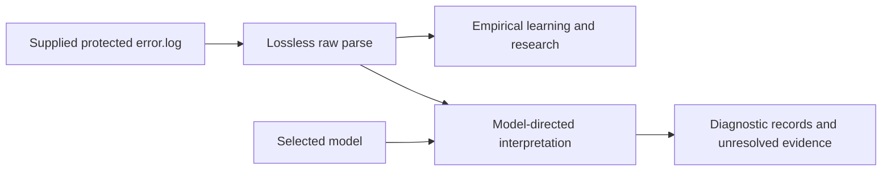

# Shared lossless parser: expected functionality and outputs

Updated: 2026-09-26.

**Published recovery revision `ck3-lossless-v1.7`:** adds an authoritative
`RawParse.iter_recoveries()` stream for emitter-based continuation association
across headers. Source history.cpp/E plus a terminal colon opens the group;
adjacent title-entry framing and opaque byte-prefix equality associate entries.
No character recognition, ID syntax, fixed failure wording, source line numbers
or model dependency. Lexical and emission boundaries remain v1.6 behavior.
The standalone artifact and embedded versioned JSON are in `parsers/v1_7/`.

Both active adapters use shared `iter_recoveries(raw)`. Grouped recoveries retain
original `parents`, one opening message and ordered `continuations` with original
body/prefix/label/value ranges. The opening span/text remains only its own body;
`source_spans` and `Recovery.ordered_spans` cover complete evidence. Debug format
is v2. The old emission-local API described below remains useful for inspection
and explicitly pinned v1.6 models, not cross-emission consumption. See the
[v1.7 delivery and model boundary](LEARNER_CHARACTER_TITLE_CONTINUATION_STATUS.md)
and [formal handoff](LEARNER_PARSER_PIPELINE_HANDOFF.md).

**Current lexical revision `ck3-lossless-v1.6`:** one stdlib `re` scanner
emits each colon, slash, backslash, brace, bracket, parenthesis, double quote,
equals sign, semicolon and pipe as an individual token wherever it occurs.
`Div/0` remains the exact approved exception. Preserve `@` anywhere in a
continuous symbol, underscores, internal dots/hyphens and filename exclamation
marks; detach word-ending punctuation. Unicode punctuation categories supply
non-ASCII boundary classification. All original gaps and byte offsets survive.
Emission framing and message recovery are unchanged. Validation uses complete
native logs only; see [separator implementation review](LEARNER_SEPARATOR_FIX.md).

The revision notes below describe earlier behavior, superseded by v1.6.

**Filename/line boundary, revision `ck3-lossless-v1.5`:** file.txt:6 produces
file.txt, :, 6. The same mechanical suffix boundary applies to an alphabetic
filename extension followed by a decimal line reference or a hyphenated decimal
line range. It preserves scope:key and dotted numeric event identifiers.
The parser exposes the colon and line text; the learner assigns separate
LOCATOR fields to the filename/path and the line reference, with a literal colon.
Bare filenames can supply location evidence without a directory separator.

**Exact lexeme clarification, revision `ck3-lossless-v1.4`:** the owner
explicitly approved `Div/0` as one atomic lexical token. Matching is exact and
case-sensitive after surrounding boundary punctuation is detached. It does not
match inside a larger identifier, path, or variant such as Div/00.
`tooltip/description` remains `tooltip`, `/`, `description`; its slash does not
by itself identify a path. ATOMIC_LEXEMES is embedded in the standalone parser,
with owner authority recorded in owner_rules.json. No learner-side token repair.

**Filename clarification, revision `ck3-lossless-v1.3`:** leading `!` remains
attached to its adjoining string, including a bare `!!0_TFE_chars.txt`. Internal
`!` and `!` immediately before an extension remain attached as before. This
follows the owner's clarification and [Microsoft's filename rules](https://learn.microsoft.com/en-us/windows/win32/fileio/naming-a-file).
Sentence-final punctuation in `error!` still separates. The parser preserves
these boundaries mechanically; it does not assign filename or LOCATOR semantics.

**Lexical revision `ck3-lossless-v1.2`:** every `/` is a standalone
punctuation token, even without whitespace. For example,
`common/dynasties/file.txt:6` yields `common`, `/`, `dynasties`, `/`,
`file.txt:6`, with adjacent original byte ranges and no invented gaps.
The learner recognizes a LOCATOR across that ordered range. The parser does
not assign slot types. Adjoining `@` and other internal symbol punctuation
retain the v1.1 behavior. Manifest version and digest invalidate older cached
pieces; consumers must explicitly select this revision and reparse.

**Status: lossless raw parsing and automatic message recovery implemented.**
The owner directed shared message recovery before the learner refactor, then
approved the structural approach and implementation. Emissions retain grouping
and source ranges without duplicating their original bytes. Failure plus reason
(including L1/L2 contracts) is one message. Recovery does not assign layer meaning.

The native survey is in [LEARNER_CONTINUATION_SURVEY.md](LEARNER_CONTINUATION_SURVEY.md).
The delivered interface and 73-log recovery evidence are in the
[formal pipeline reply](LEARNER_PARSER_PIPELINE_HANDOFF.md). Pipeline caller
migration and the learner's switch from emission to recovered-message collection
remain subsequent work. Native model/matcher delivery is not claimed complete.

Inputs to this specification:

- [Learner model dependencies](LEARNER_MODEL_DEPENDENCIES.md), especially A2,
  A3 and A7, as clarified in the current discussion.
- [Parse audit and owner corrections](LEARNER_RAW_PARSE_AUDIT.md).
- [Learner workflow audit and five-step sequence](LEARNER_WORKFLOW_AUDIT.md).

## 1. Purpose and responsibility

Provide one lossless interpretation of the supplied native CK3 `error.log`
that both empirical research and the classification pipeline can consume.
Learning uses the raw content to develop models. Runtime compares the raw
content with a selected model and refines the results into diagnostic records
for SQL. The raw parser does not itself create those diagnostic records.



The parser identifies native framing and lexical positions. It does not know
which text is PARAM, KEY, another slot type, a template constant, an error
category, or an L1/L2 component. A raw word that later occupies PARAM is still
ordinary native text at this stage.

## 2. Input and terminology

Input is an explicitly supplied protected `error.log` and an explicitly selected
parser implementation. The parser reads the supplied content; it does not
discover live CK3 paths, acquire logs, decide training roles or create a Run ID.
The scope is the complete log as supplied, without entry-count or message-length
limits that discard native content.

| Term | Meaning in this specification |
|---|---|
| Emission | A recognized timestamp/level/source header and the following content up to the next recognized header or end of input. Equal timestamps do not merge emissions. |
| Header prefix | The timestamp, level and source framing through its closing `]:`. It is distinct from the rest of the first physical line. |
| Emission body | All original content following that prefix within the emission, including initial spacing, continuation lines, wrappers, locations and trailing content. This is a mechanically bounded region, not a semantic diagnostic. |
| Lexical token | An ordered piece of original text, with original boundaries. It has no template slot type or error meaning. Revision v1.6 preserves whitespace runs and separates every directed separator wherever it occurs; contextual punctuation follows section 10. |
| Gap | Native content between lexical tokens, including spaces, tabs and line endings. It remains retrievable even if represented separately from tokens. |
| Recovered message / child | An individual message identified within an emission by the selected parser's structural recovery. Its original parent and surrounding content remain available. |
| Shared context | Original wrapper or other surrounding content associated with multiple recovered messages; for example, one enclosing filename. It is not copied into invented message text. |
| Diagnostic record | A later, model-directed interpretation stored by the pipeline. It is not a raw emission or a parser-created issue. |

The observed header form is `[HH:MM:SS][level][source]:`. Support for the old
two-field fixture form is rejected. This statement does not authorize a new
timestamp-validation subsystem or retain compatibility with old parser APIs.

## 3. Expected parser functionality

The labels below identify behavior for review; they do not prescribe classes,
function names, algorithms, serialization fields or tests.

| Requirement | Expected behavior | Basis in owner direction |
|---|---|---|
| `RAW-PARSE-COMPLETE` | Preserve the complete supplied native content, in order. Exact content remains obtainable; decoded displays or derived views do not replace it. No suffix stripping, masks, value replacement, whitespace loss or truncation in the raw result. | Lossless raw parse; retain native literals and evidence. |
| `RAW-PARSE-EMISSIONS` | Expose each complete emission and its original boundaries. Keep its continuation together regardless of the number of physical lines. A new recognized header starts a new emission. | Header-to-next-header emission boundary. |
| `RAW-PARSE-SOURCE` | Expose timestamp, level and original engine source tag as observed facts, linked to the exact header. Preserve the source family needed for model applicability without losing the original tag. | Source-applicable models and shared parsing. |
| `RAW-PARSE-POSITIONS` | Expose ordered lexical content and native boundaries, including access to intervening whitespace and punctuation. Positions refer to original input, not rewritten text. | Owner's token/boundary retrieval requirement. |
| `RAW-PARSE-RETRIEVAL` | Given explicit native boundaries, return the corresponding exact content. A complete range includes all interior spaces, punctuation and line breaks. The operation does not discover slot boundaries or infer a slot type. | Owner's functional retrieval example. |
| `RAW-PARSE-MULTI` | Preserve all content and repetitions needed to identify individual messages within an emission. Where children are recovered, expose their original positions, parent relationship and shared context. Do not equate emission count, physical-line count and error count. | Owner's multi-error continuation requirement and alternative recovery routes. |
| `RAW-PARSE-SELECTION` | Use the explicitly selected version/artifact. An independent consumer using that reference obtains the same native content and boundaries. There is no silent parser substitution or legacy fallback. | A2 and explicit rejection of backwards compatibility. |
| `RAW-PARSE-METADATA` | Associate parser identity once with the Run-level processing metadata. Before a Run ID exists, research/raw-parse output carries that context once at its top level. Do not repeat parser identity on each emission or diagnostic. | Owner's metadata correction; model-level parser reference remains required by A2. |

Losslessness applies to the full output, not merely to an example string saved
alongside a stripped matching input. Both consumers receive access to the same
native representation. The learner's feature aggregation and the pipeline's
diagnostic aggregation are later operations; neither changes the raw parse.

Original byte positions and decoded character positions must be distinguishable.
A consumer must not interpret a character index as a byte offset. Version 1 represents those positions as absolute byte ranges, with exact text retrieval. It does not expose character indexes as byte positions. The examples below use
absolute, zero-based byte ranges `[start, end)`: the start is included and the
end is excluded. This notation permits unambiguous review without choosing an API.

Under A2, the exact parser reference identifies its version, retrievable artifact
and the content hash covering its implementation. It is carried at the shared
metadata scopes above and in the model's reference; it does not require a hash
or parser-version field on every emission. Section 10 defines the explicit local-artifact loader and reference.

## 4. Meaning of the outputs

These are logical outputs, not a proposed JSON schema or database layout.

| Scope | Information the consumer must be able to obtain | What it does not assert |
|---|---|---|
| Parse context | Which supplied input is being read and which exact parser was selected; access to its original content. Parser identity is held once. | A new Run ID, a per-emission hash identity, a classification result or a new custody system. |
| Emission | Source order, exact extent, physical log position for inspection, header-prefix extent and complete body extent. | That the emission contains only one error or that all continuation lines are errors. |
| Header facts | Observed timestamp, level and complete source tag; source-family interpretation retains the original tag. | A diagnostic severity/confidence policy or the script location implicated by the message. |
| Lexical view | Ordered native text pieces with token/gap boundaries and their relationship to the original. | KEY/PARAM boundaries, normalized identifiers or learned template literals. |
| Range retrieval | Exact native bytes and corresponding text for the explicitly chosen region, including interior formatting. | A search for a plausible value, a reconstructed sentence or a new semantic boundary. |
| Individual-message recovery | Ordered children, their original content/positions, parent and shared context; parent remains intact. | That an unrecognized continuation contains only one error, or that the current two phrase rules are complete. |

For a log containing an unfamiliar message, the raw content remains available
without needing a model assignment. Unknown classification is a later result;
it does not prevent lossless representation of the emission. A parser that
cannot complete its stated operation must expose that failure rather than
silently skip content or substitute another parser. This does not commission
special malformed-input recovery or compatibility behavior.

## 5. Individual-message output

Shared parsing recovers individual messages before learning or matching. A whole
emission is their parent container, not a substitute learning unit. The current
implementation recognizes the native repeated-message wrapper and the observed
single-message continuation structures. Unsupported structures retain their
complete evidence with an explicit unresolved result and no claimed messages.

A failure plus its reason (including L1/L2 contracts) stays one message, with
associated location/trace content. The parser establishes native boundaries;
the learner establishes semantic layers and slots. It never needs a model to
recognize the supported message framing.

The wrapper grammar does not enumerate error introductions. It accepts mixed
message wording and retains each child's location annotation and shared wrapper.
Neither a newline nor the presence of an error-related word is a universal
message separator. The implementation and precise limits are documented below
and in the formal pipeline handoff.

## 6. Genuine examples and expected outputs

The source is the protected log already used in the audits:

`C:/Users/nateb/Documents/ck3chronicle/.ck3chronicle/wip/benchmarks/ingestion/legacy-pending-rehearsal-20260908-01/sessions/1fc0ecb983d7c3726d880384a38581e6c6daa6c58870f0cbc01e6e1857e7c7d2/error.log`

These are annotated observations of native content, not synthetic fixtures,
old-classification expectations or demonstrations of a new parser. Byte ranges
were read directly from this file for this draft. Selected complete native
examples remain in ignored
`.codex-tmp/learner-parser-audit/native-snapshots.json`; the document quotes only
the portions needed to explain the required output. Displayed snippets do not
establish replacement line endings or whitespace for the raw output.

### E1. Inline location and enclosing location remain distinct

Physical log line 301 contains an unknown-trigger message with
`, near line: 261`, followed by an enclosing file wrapper with `near line: 273`.

| Native item | Expected obtainable range/content |
|---|---|
| Complete emission | `[60506, 60719)` |
| Header prefix | `[60506, 60551)`; the body begins immediately after this, including its initial space. |
| Child's near-line text | `[60621, 60635)` returns exactly `near line: 261`. |
| Enclosing near-line text | `[60703, 60717)` returns exactly `near line: 273`. |

The source tag is `pdx_persistent_reader.cpp:216`. Its engine-source line 216,
the physical log line 301, the child's 261 and the wrapper's 273 are different
facts. The parser must not substitute one for another or erase the native labels.

For the child's near-line text, these source intervals illustrate the positions
that remain accessible, without prescribing a tokenization algorithm:

| Native text | Byte range |
|---|---|
| `near` | `[60621, 60625)` |
| one space | `[60625, 60626)` |
| `line` | `[60626, 60630)` |
| `:` | `[60630, 60631)` |
| one space | `[60631, 60632)` |
| `261` | `[60632, 60635)` |

Whether a model later assigns LOCATOR to `261` is outside parsing. Retrieving
the entire range must return `near line: 261`, including both spaces and `:`.

### E2. Repeated children and one shared wrapper

Physical log lines 593-595 are one emission, `[106271, 106543)`, containing:

```text
Unknown trigger: kinslayer_3, near line: 420
Unknown trigger: kinslayer_3, near line: 421
Unknown trigger: kinslayer_3, near line: 422
```

The three message-text ranges are `[106325, 106369)`, `[106370, 106414)` and
`[106415, 106459)`. Each gap between those message-text ranges is an original
line break, which remains present. The enclosing wrapper names
`common/scripted_triggers/zzz_99_religious_triggers.txt` and says
`near line: 423` at `[106527, 106541)`.

Expected raw output: one complete ordered emission with all three occurrences,
their distinct locations, line breaks and full wrapper. Automatic recovery
exposes three messages associated with that same wrapper. The complete emission
remains their source/range parent. Recovery never reduces the raw content to
three copies of `Unknown trigger: <KEY>`.

### E3. Empty observed content must not acquire invented slots

Physical lines 2625-2627 form one emission, `[349885, 350135)`. Its first
message-text range `[349939, 349992)` contains:

```text
Failed to read key reference: : , near line: 25017476
```

Two subsequent messages use near-line values 25017479 and 25017481. The enclosing
filename is `""`, with near-line value 25017490. All remain original content.
No parser-created KEY, OPTIONAL_KEY, placeholder value or guessed filename is
inserted into the empty positions. Their meaning belongs to later interpretation.

### E4. Bracketed reason with native trailing content

Physical lines 4747-4750 form one emission, `[516754, 517029)`, from
`jomini_script_system.cpp:303`. The body includes:

```text
Error: capital_county.kingdom trigger [ Failed context switch ]
  Script location: file: common/activities/guest_invite_rules/activity_invite_rules.txt line: 872 (activity_invite_rule_local_exam_entrants)
```

`[516829, 516851)` returns `capital_county.kingdom`,
`[516862, 516883)` returns `Failed context switch`, and
`[516888, 516904)` returns `Script location:`. These are native ranges, not
parser-assigned KEY/L2/location fields.

The closing bracket does not end the raw body. The location label, filename,
line number, parenthesized text and original formatting all remain available.
Version 1 keeps the dotted expression in one lexical token and exposes its
complete native range. No semantic KEY assignment occurs during parsing.

### E5. Multiple trace lines are not automatically multiple errors

Physical lines 3958-3963 form one emission, `[457680, 458165)`. Its
`set_knight_status effect` message is followed by three native `file:` frames.
The expected raw output preserves their order and complete text inside the
same emission. A newline splitter must not manufacture one error per frame.
No interpretation of which frame caused the failure belongs to the raw parser.

### E6. A location label can precede `Unknown`

Physical lines 3723-3726 form one emission, `[435772, 435993)`. The range
`[435966, 435990)` returns exactly `Script location: Unknown`.

Expected output preserves that label and value as supplied. It does not invent
a frame, file or line number, and does not delete the label because no file is
present. Any future trace interpretation must respect this observed form.

These examples establish expected content and boundaries for review. They do
not establish the full universe of CK3 messages or a universal recovery grammar.

## 7. Optional debug output on disk

The owner suggested retaining the raw parse on disk for debugging. Version 1
provides explicit save/reload operations; production parsing does not
automatically persist a second copy.

The implemented behavior is to save an inspectable representation of
the same raw result and reload it without classification or learning. The
reloaded result must provide the same native content, order and boundaries;
parser metadata belongs once in its context. A cache of masked, deduplicated or
truncated learning features does not meet this purpose.

The optional JSON snapshot embeds the original bytes once as base64 and lists
inspectable native ranges and text. Saving is caller-directed. No production
retention policy is introduced. Generated raw output remains outside Git. No raw-parse
database or new operational retention policy is specified here.

## 8. Responsibilities excluded from the parser

- Slot inference and the five-slot vocabulary; matching establishes capture
  boundaries and meanings after raw parsing.
- Template generalization, similarity, clustering, error typing, model
  promotion, confidence, L1/L2 assignment and diagnostic identity/aggregation.
- Sentence-specific rewriting, key masking/decomposition, suffix removal or
  any other concealed preprocessing before or after matching.
- Semantic projection, old classification paths, legacy compatibility,
  fixture-only header support or automatic fallback to another parser.
- SQLite writes, Run creation, input acquisition, live-log watching and the
  owner's separate runtime inspector.
- New feature work for empty files, special preamble objects, or hypothetical
  malformed-header repair. Those have not been established as required CK3
  functionality. Ordinary preservation of real continuation lines remains in scope.

## 9. Owner review and subsequent authorization

Step 1 was saved and reviewed before implementation. The owner then directed:
spaces separate tokens; do not subdivide continuous strings at internal
punctuation; sentence-ending punctuation should split; proceed with parser
work. The owner subsequently clarified that commas and colons at word ends
also separate: preservation concerns punctuation INSIDE continuous strings.
The boundary-punctuation rule below implements that correction. It does not assert semantic knowledge
of keys, abbreviations or sentence grammar.

## 10. Design and reasons

### Framing and storage

Read the explicitly supplied file as bytes. Recognize only the native
`[HH:MM:SS][level][source]:` form at physical line starts. The next recognized
header bounds the current emission, regardless of timestamp equality. A UTF-8
BOM at byte zero belongs to the first header span. The header span ends just
after `]:`; the body includes every subsequent byte through the next header.
There is no two-field header mode, phrase taxonomy, malformed-header repair,
preamble record or silent skip. Content that cannot start a native emission
fails explicitly rather than disappearing.

Version 1 holds original bytes once in a `Source`; emissions reference that
source and store offsets. Lexical pieces are calculated when requested. This
makes the source independent of a later file replacement and makes exact
retrieval straightforward. The tradeoff is whole-file memory use; no input
length or token-count cap is introduced. Streaming/mapped storage is not
required or claimed by this delivery.

Native byte offsets are authoritative. Decode with UTF-8 `surrogateescape`;
encoding with the same handler recovers the original bytes. This avoids a
replacement character erasing the original value. Display strings containing
undecodable bytes are not semantic repairs. JSON snapshots escape those code
points and embed the original bytes independently.

### Lexical segmentation

1. Each maximal whitespace run is one `gap`, preserving spaces, tabs and line
   endings exactly. The standard-library Unicode whitespace definition is used.
2. The scanner emits each member of `ALWAYS_SEPARATORS` as its own token:
   colon, slash, backslash, braces, brackets, parentheses, double quote, equals,
   semicolon and pipe. Whitespace is not required around them.
3. The exact `Div/0` atom is the approved slash exception. It does not match a
   substring inside a larger symbol or path.
4. `@` stays within continuous symbols at any position. Underscores, internal
   dots, hyphens, numeric signs and leading/internal filename exclamation marks
   remain intact. Commas and sentence punctuation detach at word endings.
5. Non-ASCII boundary punctuation uses `unicodedata.category` (`P*`), preserving
   internal punctuation and original characters. Edge punctuation is emitted
   individually; punctuation runs do not hide a directed separator.
6. The implementation uses ordered regex alternatives in a single token scan.
   It verifies complete character coverage and constructs absolute byte ranges
   using the existing UTF-8/surrogateescape representation. No normalization,
   quote removal or punctuation discard occurs.

Inspectable examples from complete native emissions:

- `scope:ck3ia_jace_desmond` becomes `scope`, `:`, `ck3ia_jace_desmond`.
- `host=[ROOT.GetUIName` becomes `host`, `=`, `[`, `ROOT.GetUIName`.
- `(:)` becomes `(`, `:`, `)`.
- `00_bgp_dynasties.txt:6` remains filename, colon, number.
- `!!0_TFE_chars.txt`, `capital_county.kingdom` and `Div/0` remain intact.

Original messages, sources, log hashes, emission ordinals, before/after pieces
and byte offsets are saved in the native review linked above. These observations
are not an exhaustive grammar claim. Token boundaries expose native structure;
range retrieval still returns any explicitly selected original byte interval.

### Individual-message ownership

`Emission.recovery` invokes the selected artifact's `recover_messages` function.
A `Recovery` contains its `parent`, `status`, syntax `structure`, ordered
`messages`, `shared_spans`, `unresolved_spans` and an optional unresolved `reason`.
Its `ordered_spans` accounts for every parent byte exactly once in native order.
Store the property result locally when using it more than once; it is computed
on access rather than copied into every emission in advance.

On `status="recovered"`, each message exposes its `parent`, `ordinal`, native
`span`, `text`, `pieces`, `tokens`, `native_bytes()` and `shared_spans`. Messages
share one context tuple and one original byte source. Wrapper delimiters,
headers and inter-message LF/CRLF are retained as shared ranges. Other supported
single messages retain their complete body, including whitespace and traces.

This parent/shared representation is a raw-evidence interface, not a SQL schema.
The owner requires complete stored diagnostics: classification resolves each
message's applicable shared context before within-Run deduplication. Repeated
errors at different timestamps become occurrences against one diagnostic entry.
Reports must not join to an emission record or reread raw evidence to obtain
content needed to understand a diagnostic. Common context can be materialized
into each distinct diagnostic; parser range references remain provenance.

On `status="unresolved"`, `messages` is empty and the body remains in
`unresolved_spans`; the header remains in shared framing. Consumers must carry
that outcome to review rather than claiming one message or dropping it.

The complete quoted Error/in-file/near-line wrapper determines sibling framing.
Each entry requires one supported native near-line ending, optionally with an
expanded-from annotation. No message-introduction or engine-source whitelist
controls that split. Unsupported quoting, entries or wrapper forms remain
unresolved. Single-message structures include script-error fields, stack/From
locations and scope dumps; participant, formatted-reason and quoted-value forms
have narrower source applicability. Plain Error fields need no L1/L2 brackets.

`Emission.select_messages(ranges)` remains an explicit range-selection utility.
It validates positions only and does not claim automatic discovery. Normal
consumers use `emission.recovery` instead of supplying their own boundaries.

### Version selection and metadata

`tools/template_learning/parsers/v1/parser.py` contains the complete parsing,
lexical, message-recovery, range-selection and snapshot implementation, using only the standard
library. `v1/manifest.json` names its version, relative artifact and SHA-256.
The loader resolves that artifact to an explicit local file URI, verifies the
source bytes, and executes those same bytes. It verifies the declared version;
there is no current-version default or legacy substitution.

The reference is `{version, artifact, sha256}`. Models and feature artifacts
carry it at their top level. Raw output carries it once; emissions/tokens have
no parser version/hash fields. The application can attach it once to Run
metadata after Run creation. The parser never creates a Run.

For independent/local replay the artifact URI must remain retrievable. Copying
an artifact to another machine requires an explicit new local URI, retaining
the implementation digest/version. No network fetcher or remote publication
service is introduced. The artifact is packaged with the application under
`template_learning.parsers`, whose source remains under the learner directory.
Future published changes require a new parser version, not editing a previously
referenced artifact or falling back when its digest differs.

## 11. Callable interface and consumer use

```python
from template_learning.parsers import load_parser, reference_from_manifest

selected = load_parser(reference_from_manifest(".../parsers/v1/manifest.json"))
raw = selected.parse_file(protected_log)
for emission in raw.emissions:
    original = emission.native_bytes()
    body = emission.body_text
    pieces = emission.pieces  # ordered Piece(span, text, kind='token'/'gap')
    tokens = emission.tokens
    recovery = emission.recovery
    if recovery.status == "recovered":
        for message in recovery.messages:
            message_text = message.text
            message_tokens = message.tokens
            shared_native_ranges = message.shared_spans
    else:
        unresolved_native_ranges = recovery.unresolved_spans

literal_range = raw.text_between(start_byte, end_byte)
native_range = raw.bytes_between(start_byte, end_byte)
children = emission.select_messages(((start_byte, end_byte),))
raw.save_debug(output_path)   # optional, explicit write
reloaded = selected.load_debug(output_path)
```

`parse_bytes(data, source_name=...)` supports callers that already own the
protected bytes. `read_bytes(span)` and `read_text(span)` accept an existing
native range. File reads, raw snapshot writes and original retrieval do not
classify, rewrite, deduplicate, truncate, choose slot boundaries or write SQL.

Learner `evidence.read_evidence` calls the selected parser.
`records.collect_records(..., parser=selected)` consumes recovered messages,
retains all native pieces/gaps and occurrence references, and groups distinct
message evidence within each source. It performs no masking or diagnostic-lead
rewrite. Research artifacts carry `record_scope=message`. The parser itself
does not deduplicate. See [the learner delivery](LEARNER_REFACTOR_REVIEW.md)
for the subsequent source-specific native model implementation.

Registry sync/build and the direct learner CLI require `--parser-manifest`.
Native feature identity includes the parser reference and feature algorithm;
old registry/features are rejected rather than converted or silently reused.
The old frozen-oracle call and block-object reconstruction were removed from
these build routes: they reintroduced the old parser and masked text. The
subsequent native learner refactor delivers source-specific candidates, typed
captures and applicable L1/L2 components, with evidence in the learner delivery
review. Native candidate training ran in isolated research output; semantic
acceptance, application integration and model promotion remain outstanding.

Pipeline `raw_input.read_raw_log(path, parser_reference=...)` independently
loads the exact selected parser and returns the same raw representation,
without importing learner algorithms or the old parser. This is the delivered
pipeline raw-input boundary, not production cutover or integration into the
current model reader/matcher. Those still require the delivered native model
and subtoken/repetition-aware matching work. Existing application/pipeline
removals remain owned by the ongoing pipeline refactor; no old implementation
is used as a fallback by the new raw path.

## 12. Original raw-parser verification and limits

The owner subsequently redirected parser validation toward actual log parsing,
visual inspection and Python anomaly/outlier exploration. The corresponding
review is saved in ignored `.codex-tmp/learner-parser-review/REVIEW.md`, with a
complete fresh raw parse and inspectable examples. The reusable script is
`tools/template_learning/inspect_raw_parse.py`. Test totals below describe prior
mechanical checks; they do not resolve the lexical-design findings from that
review. Revision v1.6 addresses the token-boundary defects; its current evidence
is in LEARNER_SEPARATOR_FIX.md. Earlier review questions do not define new work.

Requirement-derived checks live in `tests/test_raw_parser_requirements.py`.
Nine new checks and fourteen existing repository checks passed (23 total).
Set `CK3_RAW_PARSER_LOG` to the protected genuine log documented in section 6;
without that explicit input, native-evidence checks skip rather than fabricate
CK3 fixtures. The old constructed lexical-example test has been removed;
separator checks operate on the supplied complete native log.

The checks cover complete original reconstruction, contiguous emission and
lexical ranges, E1/E4/E6 exact retrieval, continuous keys and ordered path segments, automatic E2
message/shared recovery, preservation of E5 trace content, optional JSON reload,
Run/parse-level metadata, exact parser selection, a fresh independent pipeline
process, learner collection with old transforms forbidden, and registry feature
round-trip with the selected parser reference.

The supplied complete log contains 1,236,107 bytes and produces 8,111 emissions.
These are observed results, not correctness quotas. It contains the annotated
multi-error continuations, native control characters, inline locations and
script-location tails. All content remains retrievable. This one log does not
prove a universal CK3 grammar or behavior on unobserved input forms.

Generated raw/debug output and verification results are kept under ignored
`.codex-tmp/learner-parser-v1/`. No production registry/database, model selection,
protected original or runtime inspector is changed by verification. The new
raw path does not demonstrate SQL diagnostic correctness or model quality.

Saved outputs are `raw-parse.json` (complete inspectable parse) and
`verification.json` (scope/results). A wheel build also succeeded; its packaged
parser source has the exact SHA-256 recorded by the selected manifest. Isolated
imports, dependency checks and `git diff --check` passed.

## 13. Completed recovery inspection

The unpublished v1 artifact now includes recovery; its manifest SHA-256 is
`d0b580313b5546f0dc809af0fb5213817faeb8907959345d1c760cf12f38837d`.
Earlier raw outputs/hash references describe the pre-recovery development
artifact and must be regenerated for current replay. No published model was
changed; old references are not silently substituted.

`inspect_message_recovery.py` replayed all 73 stable surveyed logs. It observed
2,594,601 messages from 2,517,940 emissions, with 10,404 multi-message emissions.
Every input reconstructed exactly from recovered message/shared ranges. The
90,518 distinct recovered message byte strings also reconstructed from native
lexical pieces. No unresolved structures occurred in these files; unfamiliar
future forms can still be unresolved.

The [23 recovered examples](../.codex-tmp/message-recovery-review/RECOVERED_EXAMPLES.md)
include mixed sibling errors, expansion annotations, the 915-message batch,
multiline L1/L2 reasons, scope/participant details, quoted values and long traces.
Their complete output is in `examples.json` beside that report; `summary.json`
records the complete corpus scope and results. These are ignored native artifacts.

Nine existing parser checks also passed after updating the native continuation
check for automatic recovery, including independent pipeline replay and debug
save/reload. The learner collector/registry remain emission-scoped pending their
own refactor; these checks do not claim completed model or SQL integration.

The current wheel is under `.codex-tmp/message-recovery-review/wheel/`; its
packaged parser bytes and manifest match the delivered artifact hash. Section
12's earlier raw-output/wheel paths describe the pre-recovery checkpoint.
