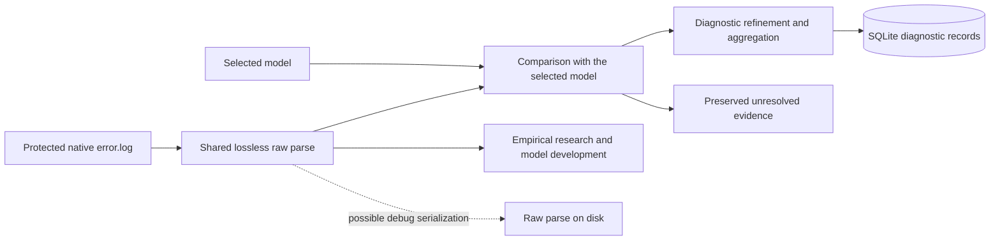

# Learner and pipeline raw-parse audit

Date: 2026-09-19. Scope: the live working tree based on `1af79a4`, including
the pre-existing, uncommitted native-pipeline changes.

Revised after owner review on 2026-09-19. The dispositions below supersede the
first audit's suggestions to keep compatibility choices open or automatically
retain the current narrow child-splitting rules. This revision records directions;
it does not claim the corresponding source deletions have been performed.

The subsequent [learner workflow audit](LEARNER_WORKFLOW_AUDIT.md) traces live
learning dependencies and the proposed separation of parser, evidence,
learning, model-output and evaluation responsibilities.

This is the owner-requested feature/function map and disposition assessment.
It is not a parser implementation, canonical-parser selection, model promotion,
application cutover, or approval of a new storage format. Product source and
production runtime were not modified. The earlier project handoff predates
the live pipeline code; this audit follows that code and the current discussion.

## Owner corrections governing this audit

- There are no shipped users or legacy interfaces to support. Remove legacy
  compatibility, fallbacks, adapters and fixture-only behavior; their continued
  existence is not a design option. Accuracy against genuine error.log content
  determines parsing behavior.
- Remove the old classification path and semantic projection. The pipeline
  exercise is already doing these removals. "Legacy projection" below refers
  to that same rejected semantic-projection stage, not another capability to keep.
  Removal includes its runtime, catalog, builder, wiring and obsolete consumers.
- Delete the two-field header compatibility feature justified by legacy fixtures.
  The owner has closed that decision. Do not reopen it as a canonical-parser choice.
- Code-only edge handling is not evidence of a CK3 feature. This audit observed
  neither a leading preamble nor a malformed header case in its genuine input.
  Empty input is not a parser-design workstream.
- Parser implementation/version information belongs once in Run-level metadata,
  not repeated on emissions or diagnostic records. Models still reference their
  exact parser under A2; a research parse made before a Run ID exists can carry
  that reference once in its file-level metadata.
- Preserve complete emissions and the information needed to recover individual
  errors, but do not presume two hard-coded introductions cover all continuation
  forms. Raw-parser child recovery and later model-directed splitting are both
  candidates. Neither has been selected by the owner.
- Audit the learner workflow separately before reorganizing implementation.
  Identify live learning dependencies, then connect versioned parsers and place
  empirical-learning logic in its own modules. Being currently called does not
  make prohibited masking or rewriting legitimate behavior to retain.

## Direction from the current discussion

The owner describes this flow:

The raw parse does not identify PARAM, KEY, error types, or the semantic end of
a diagnostic by consulting a model. It preserves text, ordering, source facts,
and emission boundaries. Whether individual children are recovered there or in
subsequent model-directed refinement remains to be evaluated. The model and classifier
determine template literals, slot spans, and applicable L1/L2 structure. Calling
raw text "literal tokens" must not imply that the parser already knows which
tokens are template constants rather than occurrence values.

The owner explicitly asks that existing multi-error continuation mechanics be
mapped before changing them. Persisting the raw parse for debugging is under
consideration; format, retention, and production enablement are not decided.
Slot types remain non-parser work under
[LEARNER_MODEL_DEPENDENCIES.md](LEARNER_MODEL_DEPENDENCIES.md).

## Findings and recommendation

There is no single current parser covering both consumers. There are two
emission readers and three locations containing child/message processing:

1. The legacy application parses into SQLite through `parser/service.py`,
   `parser/log_blocks.py`, regex extractors, and `parser/normalize.py`. It creates
   categorized issue records before empirical classification.
2. The learner and unseen-session evaluator import `parser/log_blocks.py`,
   then call learner-local message joining, splitting, rewriting, and
   tokenization. The incremental registry stores aggregated, normalized
   features, not a raw parse.
3. The replacement `pipeline/` has native-byte emission spans, child recovery,
   a literal matching view, and matcher-directed capture binding. It is not
   wired into the application ingestion route or the learner. A search of
   `src/` and `tools/` finds no callers of its emission/recovery entry points
   outside their defining modules at this snapshot.

Retain accurate emission framing and the ability to account for multiple errors.
Connect both consumers to the explicitly selected versioned parser required by
A2. The replacement's byte correspondence and child/shared spans are useful
implementation material; this does not establish its narrow splitting grammar
as the general solution. Shared raw parsing can preserve one complete emission
for later model-directed child recovery.

Do not bundle the learner's transformations into that parser merely to preserve
old output. Keep complete location content in the raw parse. Automatic script
trace separation remains a design option requiring an independently justified
grammar, not an assumed ability of the raw parser. This audit does not select
such a grammar or reinterpret location content as an L3.

## Current call paths and dependencies

| Path | Current calls/data | Consequence for shared raw parsing |
|---|---|---|
| Application parse | `cli.cmd_parse` -> `parser.service.parse_session` -> `iter_log_blocks` -> `extract_block` -> `normalize` -> DB source blocks/issues | `parse_session` is an orchestration/storage service, not a reusable raw parser. Its taxonomy and signatures must not become raw-parse fields. |
| Old classification path, directed for removal | `classification.service.classify_session` -> `Classifier.classify_block` -> `classification.normalize.block_message/semantic_units` -> classifier | Uses learned templates plus hard-coded preprocessing; child splitting happens again after DB parsing. Its empirical input does not justify keeping this path. |
| Semantic projection, directed for complete removal | `semantic_projection.analyze_complete_block/analyze_complete_message` and projection service | Reopens stored raw text to extract locations and slots after classification. This is the same stage previously called "legacy projection". No separate projection capability is retained. |
| Learner CLI | `main` -> `protected_error_logs` -> `collect_records` -> `iter_log_blocks`, `block_message`, `semantic_units`, `tokenize` -> clustering/model | Parsing and learning are interleaved; parser selection/reference is missing. |
| Incremental model build | `feature_from_log` -> `collect_records`; `combine_training_records/build_revision` consume cached features | Cache identity currently uses normalizer version, not an independently selected parser. Changing framing without changing cache dependency would reuse stale evidence. |
| Unseen evaluation | `evaluate` -> `reconstruct_model`, `inference_records` -> lexer + current learner functions | The evaluated model does not select its parser. Reconstructing a medoid also calls the current learner tokenizer. |
| Review/oracle helpers | `evaluate_frozen_oracle`, `build_review_pack.sample_message/map_samples`, `blind_review/evaluate_postfix_blind_sample.source_messages` | Reconstruct old blocks or import the lexer directly. Oracle/review mapping selects the first recovered unit in some paths. Those helpers do not establish complete multi-child accounting. |
| Projection-catalog builder | Constructs `TimestampedLogBlock` and calls the rejected semantic-projection runtime | Remove with semantic projection; do not port into the learner's new module structure. |
| Replacement pipeline | `iter_emissions` -> `recover_diagnostics` -> `normalize_for_match` -> `Classifier.classify` -> `bind_matched_spans` | Has the most useful native-span plumbing. Domain names still mix raw recovery and refined diagnostics; no persistent raw-parse writer/reader exists. |

Learner input inventory, training-role selection, occurrence aggregation, model
building, SQLite transactions, retention, and report generation remain outside
the parser. Reusing a parse must not silently merge separate occurrences.

Terminology correction from source inspection: the heritage
`parser/extractors/` taxonomy is rule-based. The old `classification/` path
really does load learned cluster/medoid/template artifacts and perform model
matching, but adds hard-coded masking, slot and candidate-selection rules.
The owner-directed removal applies to both. Calling the latter empirical was
not a claim that it is purely data-derived or suitable for the target design.

## Emission-reader feature map

Sources: [legacy lexer](../src/ck3chronicle/parser/log_blocks.py) and
[replacement reader](../src/ck3chronicle/pipeline/emissions.py).

| Feature | Existing behavior | Disposition |
|---|---|---|
| Streaming | Both read binary physical lines and retain one emission at a time. No entry-count branch or deliberate emission-length cap. | Retain. Memory is bounded by the largest emission, not a fixed constant; transient per-character mapping adds overhead. |
| Header recognition | Both recognize `[HH:MM:SS][level][source]:`; timestamp shape is recognized, not calendar/range validated. | Retain factual fields and explicit grammar. Do not infer diagnostic meaning from level/source. |
| Two-field header | Existing lexer additionally accepts `[HH:MM:SS][source]:`; comment cites legacy fixtures. Replacement accepts only three-field headers. | Delete the compatibility feature as directed. This is settled, not a canonical-version choice. |
| Emission boundaries | Each recognized header starts an emission, even with the same timestamp. Continuations end at the next recognized header or EOF. | Retain, including unterminated final lines. |
| BOM | A UTF-8 BOM at byte zero is excluded from header interpretation and retained in original content. | Retain. Do not treat a later BOM as a file-level encoding signature. |
| Source facts | Original source tag retained; trailing `:digits` removed only to derive source family. | Retain both. The number is an engine-source line, not a script locator. |
| Encoding | Metadata decode is strict; body display text uses UTF-8 replacement decoding. | Retain original bytes separately. Re-encoding replacement-decoded text cannot reproduce malformed input. |
| Original bytes | Legacy computes exact-byte hash/length but exposes `raw_block` as decoded text. Replacement uses `OriginalAccess.read_bytes` and absolute spans. | Prefer explicit byte access for losslessness. A legacy `raw_block` string by itself is not a lossless artifact. |
| Locations/order | Legacy gives physical line ranges and block IDs; replacement adds absolute byte ranges and emission ordinal. | Retain byte ranges, physical line ranges, source order and parent linkage. No semantic ordering/deduplication in the parser. |
| Header span | Replacement `header_span` covers the entire first physical line, including its message text. | Update/document terminology. It is not the exact header-prefix delimiter span. Raw output should expose header-prefix and body boundaries distinctly. |
| Order and parser metadata | Old code hashes path/start-line/block hash into an ID. Replacement emission identity is evidence ID plus ordinal; parser revision is a separate field currently repeated on each emission. | Keep ordering and span references. Move parser/recovery identity to Run-level metadata; research raw-parse metadata holds it once before Run registration. Do not perpetuate old block-hash identities or per-record parser-version fields. |

The removed "malformed header-like continuation" feature row was an inference
from ordinary control flow, not a dedicated handler or a genuine observed
example. The implementation appends any non-header line to the current emission.
That is also how real multiline messages are retained; deleting that ordinary
continuation branch would delete real content. No special malformed-header
repair feature is proposed. Unsupported compatibility/repair handlers are for
deletion, not preservation on the strength of hypothetical cases.

"Preamble" was the existing code's name for arbitrary content before the first
recognized timestamp header. No such content was found in the inspected log.
The old reader contains special preamble objects/count markers and its service
skips them. The phrase "silently discard leading bytes" described that code
path; it was not a report that bytes had disappeared from the owner's log.
Remove this unevidenced supported-input feature from the proposed parser scope,
including its count-marker/skip protocol. Do not turn it into a new design
decision for the owner. An explicit failure on input outside the parser's
supported grammar is not a second preamble-processing capability.

## Multi-error continuation recovery

Relevant implementations:

- Learner: `semantic_units` and `normalize_persistent_clause`.
- Legacy runtime: `classification.normalize.semantic_units` and
  `_normalize_persistent_clause`.
- Replacement: `pipeline.diagnostics.recover_diagnostics`.
- The similarly named `parser/extractors/persistent_reader.py` does **not**
  split children. It returns one `IssueDraft` and sorts/deduplicates continuation
  strings as `referenced_objects`.

The shared origin of the three splitters is a narrow source-specific rule:

1. Source family, case-insensitively, is `pdx_persistent_reader.cpp`.
2. The whitespace-collapsed body matches an `Error: "..." in file:` wrapper.
3. Inside the quoted body, find each `Unknown trigger:` or
   `Failed to read key reference:` introduction, case-insensitively.
4. Each introduction begins a child ending at the next introduction or the
   wrapper's closing inner boundary. Physical line breaks alone do not create
   children. Repeated children remain separate occurrences.

The learner and old runtime immediately strip child near-line content and
replace observed values with KEY markers. The replacement keeps the child
content, maps it back to original bytes, and associates each child with the
shared header/wrapper prefix and suffix. This shared association is essential:
the enclosing filename/location may apply to multiple children.

**Preserve the information and capability:** complete emissions, original order,
parent linkage, shared wrappers, locations and repeated occurrences. An L1/L2
pair is not two child errors. The current source-specific splitter is an
implementation under review, not a grammar the replacement must inherit.

**Update before treating the split as a robust shared contract:**

- Separate framing from rewriting. A framing result must not contain inferred
  KEY markers or stripped location labels.
- If structural recovery is selected, document which framing it recognizes and
  how unrecognized content remains available. Current recovery returns an intact
  message when no rule applies; it does not establish that the message contains
  only one error. This does not require new per-message parser metadata.
- Preserve ordered whitespace/delimiter spans in the raw representation;
  whitespace-collapsed text can remain a derived matching view only.
- Do not claim a general multi-error parser: only two clause introductions are
  recognized. Other forms are not automatically separate children.
- The wrapper regex is greedy and the clause recognizer is not quote/escape
  aware or anchored to physical lines. A phrase inside a value could be mistaken
  for a new clause. This is a static risk, not an observed false split in this
  investigation.
- Text before the first recognized introduction is treated as shared prefix;
  unfamiliar content between recognized introductions stays inside a child.
  Bytes can therefore survive while an unrecognized error is not independently
  recovered. Lossless byte coverage alone does not prove correct child semantics.

Two defensible approaches remain:

| Approach | What establishes child boundaries | Benefit and unresolved cost |
|---|---|---|
| Raw-parser recovery | An independently evidenced structural grammar operating within a complete emission. | Can expose children early to both consumers; requires evidence that framing generalizes beyond the two recognized phrases. |
| Model-directed refinement | Raw parsing keeps the full emission; model/template structure subsequently identifies repeated or nested messages and their shared context. | Avoids pretending the raw parser knows unknown message formulations; learner discovery and runtime interpretation must express the same child structures, including repetition and unfamiliar content. |

The second approach is a serious candidate, not a fallback. The emission is
already intact before child recovery, so it can be the shared raw unit while
research determines suitable splitting structures. Neither approach permits
unrecognized messages to disappear. There is no evidence here that the two
known clause forms exhaust multi-error continuations across CK3 sources.

## Native text, token boundaries, and exact retrieval

Sources: [emissions.py](../src/ck3chronicle/pipeline/emissions.py),
[normalization.py](../src/ck3chronicle/pipeline/normalization.py),
[domain.py](../src/ck3chronicle/pipeline/domain.py), and
[bindings.py](../src/ck3chronicle/pipeline/bindings.py).

| Functions/types | Current work | Disposition |
|---|---|---|
| `ByteSpan`, `TokenSpan`, `EvidenceSpan`, `SourceProvenance`, `OriginalAccess` | Half-open offsets, ownership scope, source facts, read-only byte access. | Retain mechanics. Document absolute byte versus view-relative token offsets. |
| `Emission`, `native_bytes`, `identity` | Parent emission, native bounds, header-line bounds, source metadata, decoded display and access to exact original. | Retain native access/order; distinguish header-line from header-prefix span. Move repeated parser identity to Run/parse-level metadata. |
| `_decode_text` | Maps decoded characters, including replacement characters, to bytes consumed from the original. | Retain principle. This is stronger than deriving byte positions by re-encoding text. Malformed encoding behavior was inspected, not exercised by the selected real examples. |
| `_coalesce`, `_Text.cut/native_origins/join` | Compose exact origins and slices. | Retain needed slicing/correspondence operations. |
| `_Text.strip/sub/literal`, `_collapse`, `_message` | Strip header prefix and collapse whitespace while preserving access to native origins; can synthesize an anchored separator. | Keep a clear distinction between raw data and derived view. Do not serialize this rewritten view as the sole raw representation. No new phrase transformations belong here. |
| `_Text.marks` | Carries marks inherited from editing machinery; current decoder creates empty marks and current consumers only propagate them. | Simplification candidate when extracting the shared parser, not required raw semantics. |
| `recover_diagnostics`, `RecoveredDiagnostic` | Child/shared spans from the narrow phrase splitter plus collapsed text; `values` defaults to empty and recovery identity is repeated per child. | Retain useful span representation, evaluate where child recovery belongs, and move recovery identity to shared Run/parse metadata. Parser does not populate semantic slot values. |
| `_diagnostic_text` | Re-reads child ranges, composes a collapsed view, checks it agrees with recovered text. | Retain correspondence responsibility; avoid unnecessary repeated decoding when a shared raw parse already supplies it. No measured efficiency claim yet. |
| `TOKEN_RE`, `tokenize`, `normalize_for_match`, `MatchingToken` | Unicode word runs and individual non-whitespace punctuation, native token origins, adjacency flag; no length cap or preassigned slots. | Reuse neutral lexical mechanics. This is currently a matching-token stream, not a complete raw token stream: whitespace is omitted and accessible only via byte ranges/origins. |
| `NormalizedView`, `NormalizedValue`, `OccurrenceValue` | Matching view and concrete values, with the view extended after successful matching. | Keep model-derived captures separate from the immutable raw parse. |
| `bind_matched_spans`, `bind_original_values`, `ValidatedPosition` | Read exact bytes for matcher-selected spans; preserve interior whitespace/punctuation and optional zero-width boundaries. | Retain downstream of the model. These functions do not discover PARAM boundaries and should not move into raw parsing as type inference. |

In particular, a dotted identifier may be several lexical tokens while one
model KEY captures their complete continuous span. Lexical tokenization does
not establish semantic slot count. A query for raw text between supplied
boundaries is model-independent; deciding which boundaries describe a PARAM is
not.

## Learner transformations: function-by-function disposition

All functions below are in
[learn_error_templates.py](../tools/template_learning/learn_error_templates.py).
The functions are currently in the learner module, not the parser package.
They are directly used by learner/evaluator paths unless a row identifies a
separate reporting/research role. Their placement in this audit did not mean
the parser calls them. No code was deleted in this audit.

| Function(s) | Current behavior | Disposition |
|---|---|---|
| `sha256_file`, `protected_error_logs`, `ProtectedLog` | Inventory configured protected sessions/pending logs, identify duplicate input content, record provenance. | Retain outside parser; no live-log discovery in parsing. |
| `strip_header`, `block_message` | Strip recognized header, trim and flatten all nonblank continuation lines. | Replace raw-path joining with shared native ranges. A derived view may handle whitespace explicitly. |
| `semantic_units` | Recover repeated children, then run transformations; otherwise strip tail and normalize. | Remove transformation coupling; evaluate structural versus model-directed recovery without assuming these phrase rules are universal. |
| `normalize_persistent_clause` | Delete near-line suffix and rewrite unknown-trigger/key-reference values. | Retire. Retain `, near line:` and actual values in raw children. |
| `split_location_evidence` | Split at first matching `Script location:`, remove label from tail return, exclude tail from template identity. | Retire automatic removal in the new path. Future structural trace annotations require an explicit independent grammar. |
| `extract_structured_slots` | Recognize travel-character structures and label display/internal/historical IDs before matching. | Remove from parser responsibility; model owns slot declarations and downstream binding. |
| `normalize_key_path` | Replace each dotted segment with KEY, retain recognized namespace syntax. | Retire semantic masking/decomposition. Preserve original text and lexical adjacency. |
| `normalize_script_system_role_slots` | Mask operation key path; rewrite travel/tributary reasons and identity phrases. | Retire preprocessing. Preserve empirically observed L1/L2 structures for model work. |
| `normalize_comparison_types` | Replace quoted comparison category values with KEY. | Retire advance slot typing. |
| `normalize_trigger_description` | Replace trigger key and source-location text with markers. | Retire advance masking; retain original labels/values. |
| `normalize_flavorization_title` | Replace a referenced title with OPTIONAL_KEY. | Retire invented optional position; optionality belongs in supplied templates. |
| `normalize_activity_event_reference` | Rewrite event/character reference into KEY/OPTIONAL_KEY layout. | Retire rewriting. |
| `normalize_known_key_grammars` | Sentence-specific handling of mesh sync, decision intervals, localization, event themes/orphans/queues, artifacts, faith, postvalidation, shader/material, audio, persistent unexpected tokens, rendered characters and scripted effects; includes TYPE insertion. | Retire from raw/preprocessing path. Needed structures must come from model development, not a second runtime interpretation system. |
| `normalize_structured_slots` | Runs travel replacement and the preceding rewrite functions in sequence. | Retire orchestration of these transformations. |
| `mask_locators` | Replace paths, filenames, and complete line/column/position labels plus numbers with LOCATOR. | Retire pre-matching masking. A model LOCATOR captures its declared value; literal labels need not disappear. |
| `tokenize` | Repeats tail stripping and structured masking; regex tokenizes, truncates to 384 tokens, collapses adjacent LOCATOR markers. | Replace with complete shared lexical view. Remove cap and marker collapse from learning input. |
| `script_system_layer_tokens` | Finds first `[` and last `]` after expected words/role; appends TRUNCATED_REASON when closing bracket absent. | Model/research concern, not generic parser semantics. Rework for complete native templates; do not retain an artificial truncation repair as evidence about CK3. |
| `diagnostic_lead`, `reason_semantic_lead`, `constant_tokens`, `template_fixed_semantics_are_ordered`, `has_ordered_anchor_overlap` | Select/filter learning or matching candidates from normalized content. | Keep outside raw parsing; reassess dependencies on removed masks in non-parser work. |
| `sequence_similarity`, `matching_pairs`, `choose_medoid`, `_meaningful`, `infer_slot`, `derive_template`, `cluster_source_records` | Clustering/alignment and slot inference, including restrictive key heuristics, ALT generation and majority-stability behavior. | Non-parser B/A4 work. Neither move these into parsing nor claim parser changes repair them. |
| `collect_records`, `SequenceRecord` | Collect/deduplicate normalized sequences, aggregate occurrences, retain up to three examples trimmed to 500 characters and location examples trimmed to 1,000. | Consume shared raw children; retain occurrence-to-native-evidence references. A feature cache remains derived, not a raw parse. |
| `TemplateCluster`, `LayeredClusterMatch`, `best_cluster`, `best_layered_cluster`, `layered_contract_id` | Candidate models and inference/composition. | Non-parser. Update for native input after the parser interface is established. |
| `mutate_key`, `mutate_locators`, `evaluate_frozen_oracle` | Historical evaluation, including synthetic mutations and first-unit selection. | Not parser behavior or current acceptance authority. Any future evaluation must use the selected parser and the intended child scope. |
| `serializable_cluster`, `write_report` | Model/report export, sampled evidence and normalized layer metadata. | Model/output work. Output cannot substitute for complete raw parse; revise native-evidence references when integration lands. |
| `parse_args`, `main` | Learner command orchestration. | Add explicit parser selection under A2; keep training configuration outside parser. |

The legacy `classification/normalize.py` repeats `block_message`,
`split_location_evidence`, `extract_structured_slots`, `normalize_key_path`,
`normalize_structured_slots`, `normalize_known_key_grammars`,
`_normalize_persistent_clause`, `semantic_units`, `mask_locators`, `tokenize`,
`script_system_layers`, `diagnostic_lead`, `legacy_diagnostic_lead`, and
`reason_lead`. Those copies need corresponding retirement from the switched
application path, not parallel maintenance or a fallback to old interpretation.

## Legacy parser-package responsibilities to retire or relocate

| Component/functions | Existing feature | Disposition |
|---|---|---|
| `log_blocks.TimestampedLogBlock`, `_parse_header`, `_make_block`, `_without_line_ending`, `_decode`, `iter_log_blocks`, `source_block_id` | Lexing, display decode, source facts and block provenance. | Connect required learner consumers to the selected parser, remove fixture compatibility and old hashed block identity; this dependency refactor is not permission for a compatibility adapter. |
| `extractors.extract_block/extract_block_for_log_type`, extractor lists/aliases | First-match taxonomy dispatch; unknown log type falls back to error extractors. | Retire from new raw parsing. Other log types do not become supported just because lists exist. |
| `script_system.match/extract/_classify_error_type` | Heritage regex error taxonomy on header text, optional file/line extraction, sorted continuation objects. | Retire taxonomy and guessed semantics. Retain complete original messages through raw parse. |
| `persistent_reader.match/extract` | One issue with sorted/deduplicated continuation objects. | Remove issue construction; determine child recovery ownership through the parser/model comparison above. |
| `localization.match/extract` | Uppercase-key recognizer, KEY replacement and guessed missing-key type. | Retire raw-path semantic extraction. |
| `database_reference.match/extract`, `event_system.match/extract`, `asset_graphics.match/extract`, `script_hygiene.match/extract` | Source/header heuristics select error types and confidence. | Classification/model responsibilities, not parser features to preserve. |
| `descriptor`, `culture_faith`, `gui_interface`, `history_setup`: each `match/extract` | Source-based categories with mostly unknown issue types and preset confidence. | Retire taxonomy; retain source facts. |
| `debug_log.match/extract/_extract_pdx_localize/_extract_gamedatabase` | Debug-log key/file/object masking and override classification. | Outside this error.log raw-parse scope; no port into Trusted Run by implication. |
| `unclassified.match/extract` | Catch-all issue creation with arbitrary warning/low confidence. | Preserve unresolved evidence as an explicit outcome; do not preserve this taxonomy-shaped fallback merely for compatibility. |
| `parser.normalize._mask_generic/normalize` | Path/line/date/address/argument masks and issue signatures. | Retire from parser. Refined diagnostic identity belongs after model interpretation. |
| `parser.service.parse_session`, `_timed_parse_stage`, `_elapsed_ms`, error classes | Evidence lookup, parse reuse/replacement, transaction control, extraction, writes, counters and progress. | Move required orchestration to current run-processing architecture; raw parser must have no SQLite dependency. Existing reparse/replacement mechanisms are not new requirements. |
| `models.parse` records/counters | SQL-era source-block/issue/cluster/parse-result objects. | Do not reuse as raw-parse schema: they already depend on `NormalizedIssue`. |

## What the genuine log established

One complete protected file was read, selected from the evidence already
identified in `pipeline/MODEL_BUGS.md`, not discovered by inventorying archives:

`C:/Users/nateb/Documents/ck3chronicle/.ck3chronicle/wip/benchmarks/ingestion/legacy-pending-rehearsal-20260908-01/sessions/1fc0ecb983d7c3726d880384a38581e6c6daa6c58870f0cbc01e6e1857e7c7d2/error.log`

The existing legacy lexer and replacement emission reader agreed on emission
line boundaries and source facts for this file. Replacement recovery yielded
8,721 children from 8,111 emissions, including 98 multi-child emissions, all
multiline persistent-reader emissions. Emission spans and the union of each
emission's child/shared spans accounted for all bytes. The current literal
matching view was built for every recovered child without a recovery error.
These are observations, not equality targets, coverage quotas, or acceptance.

| Native location | Observation | Design consequence |
|---|---|---|
| Line 301 | One unknown-trigger child has `, near line: 261`; enclosing file wrapper has `near line: 273`. Learner removes the child location. | Preserve local and shared locations distinctly; no substitution of one for the other. |
| Lines 593-595 | Three `Unknown trigger: kinslayer_3` children have near-line values 420, 421, 422; enclosing wrapper has 423. Replacement preserves three ordered children and common envelope; learner returns three identical masked strings. | Preserve repeated occurrences and shared framing while moving masking out. |
| Lines 2625-2627 | Three `Failed to read key reference: : , near line: ...` children have empty observed key positions; enclosing filename is empty. Learner inserts two KEY markers in each. | Parser must preserve empty native content and cannot infer KEY/OPTIONAL_KEY or manufacture values. |
| Lines 3723-3726 | Script message ends in `Script location: Unknown`. | A trace grammar cannot assume a file/line list is always present. |
| Lines 3958-3963 | One script error has three location frames. Recovery returns one message, not one error per frame. | Continuation line count is not error count. |
| Lines 4747-4750 | `capital_county.kingdom trigger [ Failed context switch ]` is followed by a script-location tail. Replacement raw recovery retains it; learner masks the dotted key and removes the tail. | Literal preservation and complete KEY binding are separate from L1/L2 representation. |

There were 858 script-location-bearing emissions. Nineteen identical body
texts occurred with different trace lengths; observed `file:` counts ranged
from one to 25, plus the two `Unknown` tails. This motivates comparing
representations for repetition. It does not prove that stripping tails, or
choosing an independent trace grammar, is the correct implementation.

The current model reader requires the exact arrangement `L1 [ L2 ]`, and the
classifier requires a final `]` for complete L2 matching. Thus a retained tail
can leave an L1-only result. That restriction is in model/matching code, not a
reason for raw parsing to discard native text.

Limitations: one log does not establish all CK3 framing. No model was trained
or promoted, and no selected-model classification, SQL processing, or full
parser-design comparison was performed. The audit does not establish absence
of quote-related false splits or malformed-encoding behavior. Two-field legacy
compatibility is rejected by owner direction, not left awaiting evidence.
No genuine leading-preamble or malformed-header case was observed. Existing code limitations are separated from
the observations above.

Local investigation artifacts (ignored by Git):

- `.codex-tmp/learner-parser-audit/audit.py`: reproducible read-only investigation.
- `.codex-tmp/learner-parser-audit/observations.json`: complete-file observations.
- `.codex-tmp/learner-parser-audit/native-snapshots.json`: selected complete
  native emissions in base64, child/shared spans, current matching tokens, and
  corresponding learner output; no selected emission/child text is truncated.
- `.codex-tmp/learner-parser-audit/function-inventory.json`: AST inventory of
  parser, pipeline, legacy normalization, and learner definitions.

These snapshots demonstrate existing behavior. They are not a published raw
parse format or a serialized parse of the whole file. Run the investigation
with `.\.venv\Scripts\python.exe -B .codex-tmp/learner-parser-audit/audit.py`.

## Raw parse on disk: missing capability and recommended boundary

Neither legacy source-block SQL rows nor the incremental feature cache satisfy
the proposed raw-parse role. Both are mixed with interpreted/aggregated data;
legacy decoded strings can also lose malformed input bytes. The replacement
objects retain byte access but depend on a live `OriginalAccess` implementation
and provide no public serializer/reloader.

For debugging, a useful next design is an explicit development export of the
same raw object model that both consumers use. It should be possible to inspect
the parse without running classification or learning. This is a recommendation,
not a decision to write a full duplicate parse on every production run.

The representation needs to distinguish:

- exact original bytes, stored once per emission or supplied by a named retained
  source, from replacement-decoded display text;
- source/header metadata and exact header-prefix, emission, token and
  whitespace/gap boundaries, plus any later established child/shared boundaries;
- ordered child occurrences from later learner deduplication/SQL aggregation;
- lexical tokens from template-assigned slots;
- recognized framing from content awaiting model interpretation;
- Run/parse-level parser metadata from emission-level text and positions.

Parser version/artifact identity is recorded once for a Run ID. A raw research
artifact made before Run registration has corresponding top-level metadata;
it does not create a Run ID early or repeat parser fields for each emission.
The model's exact parser reference remains model-level provenance under A2.

A self-contained debug artifact containing bytes plus spans is easier to
inspect/reload independently, but costs disk space. An index into the protected
log avoids byte duplication but is usable only while that exact source remains
available. JSON Lines with encoded bytes is one practical development option;
the on-disk format is still open. Whichever is selected, disk and in-memory
consumers should reconstruct the same raw representation, not maintain another
independent parsing implementation.

Exact retrieval takes already chosen native boundaries and returns original
bytes/text. It does not infer what PARAM means. Ordered span lists should remain
explicit if a recovered message ever consists of discontiguous native pieces;
do not accidentally include shared wrapper text by reading their enclosing range.

Raw-parse persistence does not change retained-log authority, authorize raw
payload duplication in diagnostic SQL, or permit reports to reopen raw data.
Fields required in database-only reports still need deliberate model-directed
refinement and storage. Diagnostic identity/aggregation is a separate decision
from where parsing places boundaries.

## Concrete update boundary following this audit

1. Complete the separate learner workflow audit: identify actual dependencies
   and module ownership. Its parser work package now explicitly sequences
   expected functionality/outputs, design/interface, versioned code, native-output
   verification, and only then consumer connection. The audit itself is not
   proof that the new parser exists or works.
   Remove rejected fixture/compatibility features; they are not frozen into a
   new parser version. Selection of an exact research/model parser is deliberate
   versioning, not automatic legacy fallback or backwards compatibility.
2. Establish one immutable raw representation, including complete original
   correspondence and neutral token/gap boundaries. Extract existing span
   mechanics where useful. Do not put model-assigned values in that raw layer.
3. Compare structural child recovery with model-directed refinement of intact
   emissions. Account for the demonstrated multi-error content while avoiding
   a claim that the current two phrase rules describe all possible continuations.
4. Adapt learner, registry feature inputs and explicitly required research consumers
   to the selected parser. Parser reference must participate in generated-model
   metadata and parse-dependent cache selection. Old feature files cannot be
   relabelled as raw native evidence. The separate runtime inspector is excluded;
   historical evaluator imports do not make that tool a required deliverable.
5. Add the agreed development serialization/reload route using that same
   representation if raw-dump persistence is selected. Keep outputs ignored
   or outside Git.
6. Handle native template derivation, slot types, complete L1/L2 plus trailing
   content, error typing, overrides and model promotion in their owning
   non-parser work. Wire the pipeline to the model's exact parser reference.

The useful remaining choices concern structural versus model-directed child
recovery, raw-artifact storage, and whether a separate trace grammar earns its
place. Legacy compatibility, two-field fixture support, semantic projection,
empty-input feature work and special preamble processing are not open product
choices. No implementation or operational cutover was performed by this audit.
