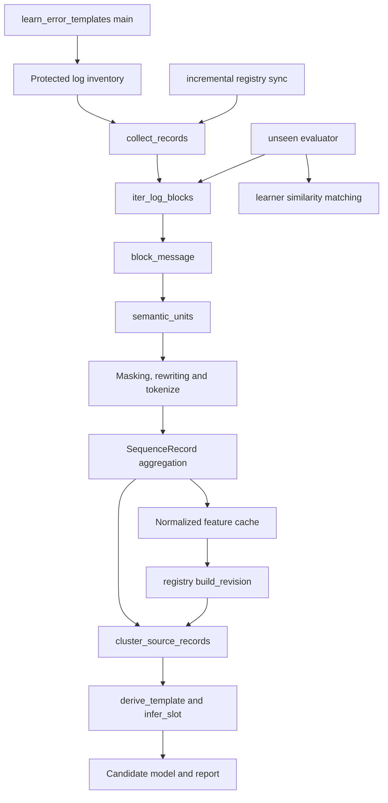

# Learner workflow and versioned-parser integration audit

Date: 2026-09-19. Examined the live working tree based on `1af79a4`.
Plan clarified: 2026-09-20, to make parser specification, design, code and
verification explicit before consumer integration.

## Current implementation checkpoint — 2026-09-20

The subsequent owner-authorized source-specific learner refactor is now
implemented. [LEARNER_REFACTOR_REVIEW.md](LEARNER_REFACTOR_REVIEW.md) supersedes
the intermediate emission-collector status below and records the candidate,
native verification and remaining pipeline/model-quality work. The audit's
historical source descriptions are not the current learner implementation.

Shared lossless parsing and automatic structural message recovery are now
implemented in the unpublished v1 artifact. The owner approved the recovery
plan after the [native continuation survey](LEARNER_CONTINUATION_SURVEY.md).
Failure plus reason (including L1/L2) remains one message. Recovered messages
reference their parent emission's source/range and shared context without
copying the complete emission text. Unknown framing remains explicitly unresolved.

The [formal pipeline reply](LEARNER_PARSER_PIPELINE_HANDOFF.md) and
[parser specification](LEARNER_PARSER_SPEC.md) contain the current API and hash.
Native replay of 73 stable logs produced 2,594,601 messages from 2,517,940
emissions, with exact original-byte reconstruction. The ignored
`.codex-tmp/message-recovery-review/` contains 23 reviewed output examples and
complete counts. Independent pipeline replay and raw debug reload passed.

The selected parser is connected through `evidence.py` and `pipeline/raw_input.py`.
However, the existing learner collector and registry still group complete
emissions. That intermediate input must now be refactored to use recovered
messages plus shared context and explicit unresolved outcomes. Native model
learning, slot/L1/L2 inference, historical research caller cleanup and pipeline
model/matcher/SQL integration remain outstanding. The pipeline team owns its
caller migration. No model was trained/promoted and no production data changed.

The subsequent [100-case before/after review](../.codex-tmp/parser-100-review/INDEX.md)
now supplies the primary caller comparison, with actual serializer JSON separate
from readable range resolutions. The next implementation sequence is in the
[learner refactor plan](LEARNER_REFACTOR_PLAN.md); it has not been executed.

The remaining sections preserve the **pre-change workflow audit** as historical
analysis. Present-tense descriptions below refer to that inspected baseline,
not the current parser implementation.

## Findings that determine the work

The learner's learning algorithms do **not** run through the parser package.
Its direct imports from that package are `TimestampedLogBlock` and
`iter_log_blocks` in `parser/log_blocks.py`. Almost all other relevant behavior
is concentrated in `tools/template_learning/learn_error_templates.py`: joining
messages, narrow child splitting, rewriting, tokenization, feature collection,
clustering, alignment, template derivation, slot inference and evaluation.

`normalize_key_path` is live learner-local preprocessing. It is not an unused
parser helper or merely a duplicate of a runtime function. Removing its code
without changing its callers would break the learner; preserving its masking
behavior would violate native-message requirements. The correct change is to
replace that preprocessing path with complete raw text and move legitimate
learning responsibilities into explicit learning modules.

The first work package is **define, design, implement and verify the versioned
parser, then connect the learner**. The earlier wording compressed these into
"establish a shared raw interface" and omitted the actual parser deliverables.
The expanded sequence below corrects that gap. Refactor consumer imports only
after the parser's expected outputs and demonstrated behavior are explicit.
Do not leave a compatibility wrapper pointing at the old parser.

## What "old empirical classification" actually contains

There are two different mechanisms in the current application source:

| Component | Observed behavior | Owner-directed disposition |
|---|---|---|
| `parser/extractors/` and `parser/normalize.py` | Handwritten source/phrase taxonomy, masks, preset confidence and signatures. | Remove from the replacement architecture. This is rule-based classification. |
| `classification/model.py`, `classification/inference.py` and `classification/normalize.py` | Load learned clusters, medoids, template tokens and layer structures, then use similarity, template validation and handwritten normalization/type rules. The selected source artifact identifies training inputs and learner versions. | Remove this old implementation in the pipeline work. It has empirical model input, but is not purely learned interpretation and is not suitable for the target native-template boundary. |
| `semantic_projection.py`, `semantic_projection_service.py`, `classification/projection_catalog.py` and catalog wiring | A second stage interprets classifier results and extracts/maps fields. | Remove completely. "Legacy projection" is this same semantic stage, not another feature. |

The old classifier is therefore not accurately described as having no empirical
content at all. That correction does not change its removal. The learner's
`cluster_source_records` and `derive_template` also perform real data-dependent
learning; their existence does not justify the preprocessing that distorts their
input.

The main learner, evaluator and registry do not import application
classification or semantic projection. The exception among learner-directory
tools is `build_semantic_projection_catalog.py`, which explicitly imports both
and is for deletion, not adaptation. Its imports must not force compatibility
support. Runtime/catalog/schema/report wiring is owned by the ongoing pipeline
removal; the obsolete builder, generated projection selection/package entries,
and documentation references must be removed with that capability.

## Current live workflow

### Input and feature collection

`main` inventories protected inputs using `protected_error_logs`; it excludes
explicitly supplied hashes and invokes `collect_records`. The registry has a
second inventory function, `candidate_paths`, and calls the same collector
through `feature_from_log`. Both are configured input handling, not parsing.

For each block, `collect_records` currently:

1. Skips blocks lacking a timestamp.
2. Calls `block_message`, which removes the header and flattens whitespace.
3. Separately collects a script-location example and recognizer-derived slots.
4. Calls `semantic_units`, which couples persistent-reader splitting to masks,
   or removes script-location content and applies sentence rewriting.
5. Calls `tokenize`, which repeats normalization, masks locators, limits the
   sequence to 384 tokens and collapses adjacent LOCATOR markers.
6. Aggregates by source family and normalized tokens, recording occurrences,
   evidence IDs and a few truncated examples. New sequences get a
   `diagnostic_lead`, which also runs normalization.

This is a lossy feature-building process. It cannot serve as the shared raw
parse even though the original log remains available elsewhere.

### Actual derivation, separate from preprocessing

`cluster_source_records` orders sequence records by occurrence count, partitions
by source and semantic lead, and selects clusters through ordered-token
similarity. `derive_template` chooses a medoid, aligns observations and retains
positions meeting its stability rule; `infer_slot` examines the intervening
spans. `TemplateCluster` aggregates support and creates a structure identity.

These are learner responsibilities to retain and improve. Known defects remain:

- The inputs have already been altered by sentence-specific masks.
- `choose_medoid` weights occurrences, and clustering order also depends on
  occurrence count. Deduplicating records does not by itself remove burst bias.
- Majority stability can retain a variable key fragment as a literal.
- `_meaningful` removes punctuation; `infer_slot` applies restrictive per-token
  identifier rules and generates ALT. TYPE is inserted by preprocessing.
- A lexical sequence is not a sequence of semantic slots. Dotted/numeric key
  capture must not be inferred by independently typing punctuation fragments.

These are A3/A4/B1/B2 learning issues, not reasons to expand the raw parser.

### Registry and artifact creation

`incremental_template_registry.sync_registry` calls `feature_from_log`, then
writes aggregated feature evidence. `feature_cache_path`, registry cache keys,
`validate_feature`, `load_feature` and `combine_training_records` currently use
`learner.NORMALIZER_VERSION` as their processing dependency. No independently
selected parser is represented.

`build_revision` consumes cached records, calls the learner's clustering and
evaluation, and writes a model/manifest revision. The revision specification
records normalizer, clusterer, threshold and training inputs, not a parser
artifact reference. The direct learner CLI writes a candidate model/report
through a different output path.

Both build routes need one artifact definition with the A2 parser reference.
Parse-dependent features need to distinguish the selected parser and the
learning feature algorithm. Old normalized feature files cannot be relabelled
as native parses; regenerate the new representation from protected originals.
No compatibility loader or registry migration chain is proposed.

### Evaluation is not currently the pipeline matcher

Scope clarification: the file inspected here is
`tools/template_learning/evaluate_unseen_session.py`. Its CLI takes `--log`,
`--model` and `--output-dir`, performs one batch evaluation and writes
`FIRST_INFERENCE.json`, CSVs and a Markdown report. It contains no live pipeline
monitoring loop or inspector UI. The owner's separately mentioned runtime
inspector has not been identified in this checkout and is outside this work.
If any tool is that inspector, ignore it for learner refactoring. A dependency
inventory does not commission maintenance of historical evaluation utilities.

`evaluate_unseen_session.reconstruct_model` re-tokenizes stored medoid text
using the currently imported learner implementation. `inference_records`
re-parses the log and runs the same masks. Neither selects parsing from the
model's exact reference.

The evaluator calls `learner.best_layered_cluster`. Its `best_cluster` path
chooses the highest medoid similarity after source/lead/anchor filtering; it
does not require an exact full alignment against `template_tokens`. The L2
path additionally checks fixed words in order while ignoring punctuation.
This differs materially from `pipeline.classifier.Classifier`, which aligns
supplied literal/slot structures and binds native spans.

Consequently, an unseen-evaluation assignment is not proof that the delivered
native model loads and matches in the pipeline. Keep similarity useful for
learning research, but label it accordingly. Model integration evidence should
exercise the actual consumer matcher and the model's referenced parser.
Re-tokenizing a stored model through an unrelated current normalizer must end.

Historical `evaluate_frozen_oracle` and `build_review_pack.map_samples` use the
first recovered unit in some paths. Their old mutation/equality checks do not
create new requirements. Any retained research view needs an explicit emission
or child scope and complete native evidence references.

## Dependency impact of removal

| Consumer | Existing dependency | Required action |
|---|---|---|
| `learn_error_templates.py` | Direct `TimestampedLogBlock`, `iter_log_blocks`; learner-local functions call each other. | Replace the parser dependency explicitly; preserve legitimate learning calls in learning modules; remove the rejected transforms. |
| `evaluate_unseen_session.py` | One-shot historical evaluator; direct lexer import and learner types/tokenizer/matcher/mutation helpers. | Inventory only; not an automatic refactor dependency or parser acceptance tool. Any currently required helper belongs in its owning module, not in a preserved historical evaluator. The separate runtime inspector is excluded. |
| `incremental_template_registry.py` | Imports learner constants/types/collector/clusterer/exporter; default callable arguments bind some helpers at function definition. | Pass the selected parser through sync/collection/build context explicitly. Update cache identity and artifact creation; do not use a mutable global parser switch. |
| `build_review_pack.py` | Constructs old block objects and re-tokenizes medoids through learner. | Use selected-parser native evidence and explicit model structures. No old block adapter. |
| `blind_review/build_blind_stratified_sample.py` | Calls evaluator reconstruction/collection and learner similarity. | Adapt only if retained for a current research task; no preservation of historical evaluation rules as gates. |
| `blind_review/evaluate_postfix_blind_sample.py` | Imports lexer directly, uses learner transforms, hard-coded old model/input locations and historical adjudication rules. | Retire the obsolete fixed exercise; any owner-directed future review uses current shared interfaces. |
| `analyze_script_system_layers.py` | Reads normalized registry feature files directly; interprets brackets/roles itself. | Research consumer of new feature/model evidence if retained, not a parallel parser or runtime layer grammar. |
| `mine_symbol_suffixes.py` | Reads normalized features, calls evaluator reconstruction and learner similarity; assumes locator masks. | Keep symbol investigation in research; revise input/context interpretation. It must not supply hidden raw-parser rules. |
| `blind_review/compare_blind_adjudication.py` | Reads comparison artifacts without parser/learner imports. | No parser dependency to preserve. Historical adjudication is not active authority. |
| `build_semantic_projection_catalog.py` | Imports old classifier, normalizer, projection catalog/runtime and block type. | Delete with semantic projection. Do not refactor into the new learner. |

Removing `parser/log_blocks.py` before changing the direct imports would stop
the main learner, evaluator and several review tools at import time. Removing
the old classifier/projection does not remove the main learner's algorithms;
the projection builder is the explicit dependent tool to delete.

## Proposed module ownership

Keep reusable learner source under `tools/template_learning/`. The following
are proposed file responsibilities, not created modules or an approved physical
layout. Existing CLI entry files can remain thin command entry points; they
are not compatibility shims.

| Owner/file proposal | Responsibilities and existing functions |
|---|---|
| `parsers/api.py` and `parsers/<version>/` | Model-independent emission/text/span interface and selected parser implementation. Preserve exact native content; no KEY/PARAM inference, learned error typing, SQL, model matching or semantic projection. |
| `parsers/__init__.py` | Explicit version/artifact resolution used by learner and independent consumers. No default-to-old-parser fallback. Runtime loads parser mechanics without importing learner orchestration or machine-local learner configuration. |
| `evidence.py` | `ProtectedLog`, protected input inventory, raw-parse consumption, occurrence/native-span references and `collect_records`'s legitimate collection responsibility. Source bytes/ordered occurrences stay distinguishable from aggregated learning records. |
| `learning.py` | `SequenceRecord`, `TemplateCluster`, ordered similarity/alignment, `choose_medoid`, `infer_slot`, `derive_template`, `cluster_source_records`, and research candidate selection. Improve them against native evidence; no sentence rewriting moved here as a substitute for deletion. |
| `model_artifacts.py` | Serialize/read actual learned structures, parser reference, source applicability, provenance and build parameters; consolidate the two output routes and eliminate re-normalizing stored templates/medoids. |
| `evaluation.py`, only for required learner/model checks | Explicit commissioned research measurements and actual pipeline-consumer integration evaluation. Do not recreate historical evaluators or include the separate runtime inspector. |
| Existing registry/CLI/review files | State and command orchestration or review presentation, calling the owning modules. Parser choice flows as an explicit object/reference; no import of learning functions from parser implementations. |

Learning feature selection may need its own module as it develops. No new
preprocessing primitive is authorized by giving it a new filename. The current
`normalize_*`, suffix removal and semantic masks are deletion targets, not
functions to preserve through a module move.

## Versioning, metadata and multi-error ownership

Select the parser once at the workflow boundary. Training records its exact
reference with the model and build; evaluation and pipeline use that reference.
The actual parser code covers framing/lexical behavior only. Learning settings,
feature algorithms, slot vocabulary and template derivation have their own
ownership and are not smuggled into a parser version.

Parser/recovery metadata belongs once per Run ID. Before a Run ID exists, a
research/raw-parse artifact can carry one top-level reference. Emissions carry
order and native ranges, not repeated parser metadata or legacy hash-derived
block identities. Models retain their model-level parser reference under A2.
Deliberately selecting an exact published parser is reproducibility, not an
automatic compatibility fallback. No fixture-only behavior is retained for it.

The first interface must expose the complete emission regardless of where
child splitting ultimately lives. The current two-introduction persistent-reader
splitter cannot define the universe of CK3 child messages. Compare:

- Structural recovery in the shared parser, justified by native framing.
- Complete raw emissions followed by model-directed splitting/refinement.

The latter lets learning investigate unknown continuation forms without a
parser prematurely flattening or misclassifying them. It requires the learned
representation to express repeated child structures and shared wrapper content;
the current flat cluster format cannot be assumed to do that already. If this
route is chosen, a learned boundary rule belongs to the model and its matcher,
not to a parser that would need that same model to exist first.

Neither option is authorized to split every physical continuation line. A
multi-frame script trace is one counterexample in the actual inspected log.
Keep inline location labels, full tails, punctuation and whitespace accessible
to both approaches. L1/L2 composition remains a particular observed structure,
not a universal raw-parser hierarchy.

## Parser work package: functionality through demonstrated output

The existing audits establish current behavior and dependencies. They are not
the parser specification, a settled parser design, a published parser version,
or proof that a newly designed parser works. The previous one-log execution
exercised existing code only. At the audit stop point step 1 awaited owner
review. The implementation checkpoint above and the spec now record the
subsequent authorization, delivered parser and verification.

The functionality, design and verification document now exists at
`docs/LEARNER_PARSER_SPEC.md`. Reusable parser source is delivered under
`tools/template_learning/parsers/`. Raw logs and generated parse outputs remain
in ignored local data or external runtime storage.

| Step | Work and concrete deliverable | What it establishes |
|---|---|---|
| 1. Expected functionality and outputs | The functionality/output sections of `docs/LEARNER_PARSER_SPEC.md`: owner-required operations, exact input/output meanings, genuine annotated examples and explicit non-parser responsibilities. | What the parser must do, before deciding class names or moving imports. |
| 2. Parser design and shared interface | The design/interface sections of the same spec: emission recognition, original-byte access, token/gap representation, child-recovery ownership, callable operations, version resolution and consumer use. Include reasons for the chosen design against alternatives. | How the functionality is implemented and why the interface supplies what both consumers need. |
| 3. Versioned implementation | `tools/template_learning/parsers/<version>/` plus the agreed small interface/explicit loader. Reuse justified existing mechanics; delete fixture compatibility and prohibited transformations. | Actual parser code, retrievable under its exact A2 reference, rather than a package around an unexamined implementation. |
| 4. Demonstrate outputs against native evidence | Execute that version on genuine protected logs; inspect raw outputs against annotated native ranges and the spec. Record results, defects and limitations in the verification section of the spec, with generated outputs in ignored local data. | Which specified behaviors work in the new implementation. Parser correctness is evaluated against native evidence, not old output totals or model coverage. |
| 5. Consumer connection and independent replay | Connect learner evidence collection to the proven parser; exercise an independent consumer using the exact parser reference. Pass its representation to the pipeline entry boundary and check that no second parser or hidden rewrite intervenes. | Both consumers receive the same native text, source attribution and boundaries. This completes the shared-interface claim; changing an import alone does not. |

### How the output contract will be defined

Start with the operations each consumer needs, and define the smallest raw
representation that serves them:

- Enumerate complete emissions in source order, bounded by actual header
  recognition, with the header/source facts separated from native message text.
- Obtain the original bytes/text for an emission or an explicitly supplied
  boundary range. Word/punctuation tokens and whitespace/gaps retain positions
  in that original, with byte and character offsets distinguished.
- Inspect the complete continuation, including all location labels, values,
  traces, repeated text and shared wrapper text. Nothing is declared PARAM,
  KEY, L1/L2, error type or diagnostic identity by raw parsing.
- If parser-owned child recovery is selected, enumerate each recovered child
  and its local/shared ranges without losing the parent emission. If splitting
  is model-directed, explicitly return the intact emission for that later stage;
  do not claim it has already been separated into every individual error.
- Resolve the chosen parser once per parse operation. Its reference is recorded
  at Run/parse level and in the model reference, not repeated in every record.

The design then chooses concrete types and operations for these requirements.
Names such as `parse`, `iter_emissions` and `read_original` are illustrative,
not an already frozen API. Exact retrieval never discovers the semantic
boundaries of a PARAM; it uses boundaries established by matching.

### Resolve child ownership before freezing the interface

Compare structural recovery with model-directed refinement using the actual
multi-error examples and any additional genuine continuation forms needed to
answer that question. Document which content each approach can separate and
what remains uninterpreted. Do not generalize the two hard-coded introductions
into universal grammar, and do not split a trace into errors merely because it
has several physical lines.

The base interface can always preserve complete emissions. The parser's claimed
individual-message output must nevertheless be explicit: a model-assisted design
does not satisfy A2's individual-message requirement merely by returning one long
string. Its subsequent recovery interface and ownership must be defined too.
This decision belongs in parser design before implementation/integration is
described as complete, not as an unspecified follow-up after wiring consumers.

### What "confirmed working" will mean here

Derive expected results from the specified behavior and genuine native content.
Useful evidence already exists: persistent-reader continuations at lines
593-595 and 2625-2627 of the inspected log, distinct child/enclosing near-line
values at line 301, and script tails at lines 3723, 3958 and 4747. They exercise
different structural questions; their old classifier results are not an oracle.

For the new parser, demonstrate complete emission boundaries and source facts,
preservation of original ordering/text, and exact retrieval of token ranges
including intervening punctuation/whitespace. Where child recovery is claimed,
compare its local/shared ranges and repeated occurrences directly with native
messages. Keep locations distinct and complete. If a debug serialization route
is selected, write and reload the same representation and demonstrate the same
retrieval; this does not require persisting every production parse.

Process each selected full log as supplied as well as inspecting meaningful
examples. Record any unexplained content or boundary disagreement. Unfamiliar
message content must remain accessible rather than being repaired by masks.
Use the A2 independent consumer to demonstrate that the exact selected parser
reference reproduces the same boundaries/spans. No special entry counts,
historical fixture compatibility, arbitrary coverage quota or old evaluator
score establishes correctness.

These demonstrations are parser verification, not evidence that templates have
been learned well or that diagnostic records/SQL are correct. A7's model loading,
matching, captures and spans are verified later with the actual pipeline reader
and matcher after native model generation.

## Learner work following the parser work package

1. Reorganize evidence collection, learning and model output around the shared
   parser already defined and demonstrated above. Delete sentence masks, advance
   slot insertion, suffix removal and structural truncation as native learning
   replaces those inputs. A file move alone is not completion.
2. Update registry features and both model build paths to record selected parser
   and learning dependencies. Generate new native features from originals; do
   not patch old caches into apparent compatibility.
3. Complete model-owned child/repetition structures where that design was chosen,
   native templates, trailing-content representation, five-slot learning and
   error typing. Any deliberately deferred child recovery remains visibly
   incomplete until this work supplies it.
4. Verify native model integration through the actual consumer reader/matcher.
   Historical unseen-evaluation utilities and the runtime inspector are not
   prerequisites for this parser/learner delivery.

Application classifier/projection removal proceeds in the pipeline exercise.
This dependency map identifies learner-side edits needed alongside that work;
it creates no reason to retain a second classifier, projection catalog, old
schema reader, fallback or compatibility wrapper.

## Evidence and limits

This audit used static imports/call sites, the old model loader and selected
manifest, and a read-only execution of `collect_records` on the same genuine
protected log identified in the parse audit. It did not inventory additional
archives or run registry sync, clustering, training, model publication or SQL.

The executed collector called `normalize_key_path` 1,403 times,
`normalize_persistent_clause` 1,385 times and `tokenize` 8,721 times. Only
`ck3chronicle.parser` and `ck3chronicle.parser.log_blocks` were loaded among the
parser/classification/projection modules when importing and exercising the
main learner with its evaluator and registry imports. These observations show
live dependency direction; counts are not requirements and a function call
does not mean every internal regex branch matched.

Read-only investigation script and results, ignored by Git:

- `.codex-tmp/learner-parser-audit/trace_learner_workflow.py`
- `.codex-tmp/learner-parser-audit/learner-workflow-observations.json`

All directly used learner-module functions remain inventoried in the parse
audit. This workflow audit adds lifecycle, dependency and module ownership;
it does not claim complete training quality from one collection run. Product
source, production evidence, registry state and model artifacts were unchanged.
