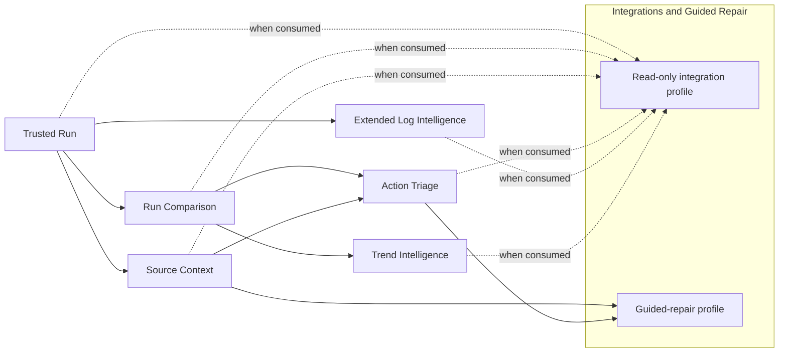

# Named capability-milestone plan

Status: active project plan as of 2026-09-08.

## Immediate checkpoint: development restart stabilization

Status: active as of 2026-09-08. This checkpoint does not replace or accept a
capability milestone. It restores a safe development/operations baseline for
Trusted Run.

Exit conditions:

1. current status, handoff, repository boundary, and owner decisions agree;
2. watcher capture-only behavior passes the new requirement-derived checks;
3. all 22 protected legacy captures and their one-time metadata/exception
   conversion are rehearsed on a verified disposable runtime copy;
4. the first failing pending-processing stage is isolated and corrected, and
   each capture can be processed without risking unrelated pending evidence;
5. database integrity and stored-result reconciliation pass after rehearsal;
6. production execution and watcher restart are separately deliberate; and
7. the complete reboot worktree is reviewed, committed, and pushed from the
   canonical repository.

Production `process-pending` is disabled during this checkpoint. Capturing new
`error.log` files does not authorize background processing.

Current evidence: conditions 1 and 2 are satisfied in the working tree. The
historical-session stall portion of condition 4 is isolated and corrected with
a successful, durably logged rehearsal at CK3's known 100,000-entry cap. The
22 protected originals have been recovered into a verified readable disposable
copy, and all 22 metadata records plus seven exception attachments were
converted there. All 22 captures completed the new exact-one-item path as
session/Run IDs 39–60. A deliberate mid-transaction interruption restored the
prior committed state through ordinary SQLite recovery and completed on an
exact-session retry. Final archive, lineage, counter, duplicate-hash,
`quick_check`, and foreign-key reconciliation passed, so conditions 3 through
5 are satisfied. The production and watcher actions remain separate explicit
decisions under condition 6; condition 7 remains open until the complete
worktree is reviewed, committed, and pushed. Detailed recovery evidence is in
`INGESTION_OPERATIONAL_RECOVERY_PLAN.md`; continuation state is in
`CURRENT_HANDOFF.md`.

## Planning rule

Milestones are semantic outcomes, not an ordinal roadmap. Implementation may
exist before acceptance, and acceptance may exist before public release. A
later capability may enter implementation only when its named dependencies
are satisfied and its own detailed specification is ratified.

## Dependency graph

Source Context may proceed independently of Run Comparison after Trusted Run.
Extended Log Intelligence needs accepted Trusted Run architecture plus a
separately ratified log-research result. A read-only integration depends only
on the accepted capabilities it consumes. Guided repair depends on the exact
accepted Source Context and Action Triage prerequisites its workflow uses.
Extended Log Intelligence and Trend Intelligence are not universal integration
prerequisites.

## Cross-cutting ledgers

| Ledger | States and meaning |
|---|---|
| Implementation maturity | Absent, scaffolded, partial, functionally complete, or hardened. |
| Product support | Internal, advanced/developer, provisional, supported, deprecated, or removed. |
| Milestone acceptance | Not entered, candidate in qualification, accepted, or superseded. |
| Public release | Unreleased, preview/alpha, beta, stable, deprecated, or unsupported. |
| Model promotion | Candidate, under review, approved, rejected, or retired. |

No ledger changes another automatically.

## Universal later-milestone entry rule

Before software development begins for any milestone after Trusted Run, the
owner must ratify a detailed specification covering:

- user problem and operator journeys;
- included/excluded scope;
- individually defined functional requirements with stable semantic IDs;
- invariants and public/advanced/internal interfaces;
- data and retention consequences;
- errors, recovery, migration, and compatibility;
- requirement-derived acceptance checks;
- milestone and release relationship.

Until that gate passes, implementation remains provisional groundwork, no
acceptance suite is active, and no task may infer missing requirements or
future tests without a new owner-directed requirement.

## Trusted Run

Stable ID: `MILESTONE-TRUSTED-RUN`

Operator outcome: after explicit root configuration, either one observed CK3
start-to-exit lifecycle or one explicit manual/recovery capture turns a valid
nonempty `error.log` into durable, compact, classified diagnostic history in
the operational production database, with one Run ID, one native review shard,
and on-demand human/structured database reports. Manual capture does not invent
lifecycle facts.

Entry conditions:

- owner intent, vocabulary, exact functional requirements, architecture,
  interface/data/retention, model-quality method, and test authority are
  ratified;
- diagnostic-record identity and native-review-shard physical contract are
  approved;
- representative real CK3 evidence is available outside Git for verification;
- no evaluator or release candidate is required to begin implementation.

Exact scope and acceptance are in `TRUSTED_RUN_SPEC.md`. The production database is an
implemented acceptance prerequisite, not a conceptual assignment.

Current maturity:

| Capability | Current evidence | Target support at acceptance |
|---|---|---|
| Explicit root configuration, diagnosis, and initialization | Partial | Supported core; exact `--config` or one fixed LocalAppData bootstrap, user paths file is sole root authority, `doctor` read-only, no discovery/fallback |
| Lifecycle observation and `error.log` capture | Copy-first one-log capture and watcher lifecycle are implemented | Supported core after controlled real-session verification |
| Run-ID content-hash guard and input boundary | Implemented in source; verification pending | Supported core; every ingest route rejects an existing `error.log` hash loudly before parsing/Run-ID creation, with no override; missing/unreadable/unstable/empty source also fails loudly |
| Crash signal and exception attachment | Partial with conflicting old behavior | Supported after categorical correction |
| Run registration/recovery | Hardened or functionally complete by seam | Supported core |
| SQLite schema/migration/audit | Hardened foundations | Supported core after operational retention/restore work |
| Log-emission recognition | Hardened lexer under current internal naming | Supported core mechanism |
| Persistent-reader multi-error split | Functionally complete focused groundwork | Supported only after splitter contract/fixtures are approved |
| Diagnostic-record aggregation identity | Partial/overlapping current issue storage | Supported after identity design/migration |
| Classification and typed validation | Functionally complete | Supported core mechanism |
| Native review shard | Absent; current review reads uncertain DB rows | Supported core after one-shard-per-successful-run implementation |
| On-demand DB reporting | Functionally complete groundwork | Supported after schema/output narrowing and raw-path non-access proof |
| Source/review/database retention, pruning, backup/restore | Partial | Supported core after completion |
| `Mounted Data:`, comparison, source resolution, triage | Existing later groundwork | Provisional; no Trusted Run credit |

Milestone acceptance requires every `TRUSTED-RUN-*` check to pass together
against one identified candidate/revision set, ordinary regressions to remain
green, and the exact model/contract set to have a separate approved promotion
record.

Public-release relationship: accepted Trusted Run is eligible for a public
0.1 alpha only after the alpha release-readiness profile passes.

Migration/rollback: configuration, lifecycle capture, input validation,
parser/aggregation, database, native-review-shard, retention, CLI, crash,
report/output, and production-test changes require separately
authorized implementation groups with verified backup, reconciliation, and
rollback.

## Run Comparison

Stable ID: `MILESTONE-RUN-COMPARISON`

Provisional operator outcome: compare selected retained runs/baselines and see
new, fixed, worse, improved, unchanged, crash-state, and visible
acknowledged-noise results without deleting underlying diagnostic history.

Dependencies: accepted Trusted Run, stable diagnostic-record identity and
model lineage, and a ratified Run Comparison detailed specification.

Working scope to take into detailed design:

- latest/previous, selected/selected, and selected/named-baseline queries;
- exact comparison identity and occurrence-count semantics;
- crash-state change;
- model/contract compatibility and common-revision behavior;
- visible acknowledged-noise annotations/default filters that never change
  auditable totals;
- on-demand human/structured comparison reports;
- persistence only for baselines, annotations, compatibility, and measured
  caches—not every generated comparison.

Current comparison/baseline/ignore code and regression tests are substantial
provisional groundwork. They confer no supported behavior until detailed
requirements and acceptance checks are ratified. The later specification must
also define what happens when database retention removes a referenced run.

Public-release relationship: may support a later preview/beta; no stable claim
is implied.

## Source Context

Stable ID: `MILESTONE-SOURCE-CONTEXT`

Provisional operator outcome: resolve a supported diagnostic reference against
approved active-runtime/override semantics and report instances, winner/merge
meaning, observation time, uncertainty, and user overrides without causal
overclaim.

Dependencies: accepted Trusted Run and a ratified Source Context detailed
specification.

The first required design deliverable is the targeted `debug.log` `Mounted
Data:` specification. Before supported implementation begins it must define:

- the exact operator question and user value;
- grammar and extracted fields;
- `debug.log` acquisition/copy timing relative to the CK3 lifecycle, complete
  publication behavior, and explicit manual/recovery acquisition if supported;
- absent, malformed, truncated, and ambiguous behavior;
- retention and temporal meaning, including behavior when the protected
  `debug.log` copy has expired;
- authority limits and read-only boundaries;
- explicit non-implication that `debug.log` is a general diagnostic stream.

Working later scope may include exact-path replacement, named merge domains,
current-versus-stored observations, unavailable/out-of-scope states, and
explicit reversible overrides. No domain—on-action, culture, or otherwise—is
accepted merely because an old plan or prototype mentions it.

Current six-state `Mounted Data:` parsing, exact-path resolver, fingerprints,
and file-instance logic are provisional groundwork protected by ordinary
regression tests. They receive no Trusted Run or Source Context acceptance
credit until the detailed gate passes.

Public-release relationship: potential beta capability; stable relationship
remains part of owner boundary selection.

## Action Triage

Stable ID: `MILESTONE-ACTION-TRIAGE`

Provisional operator outcome: provide bounded, explainable investigation
priorities and cautious recommendations—or an explicit no-recommendation
result—from accepted run, comparison, and source-context inputs.

Dependencies: accepted Trusted Run and the exact accepted Run Comparison and
Source Context capabilities consumed by the future policy, plus a ratified
Action Triage detailed specification.

Working design topics:

- permissible evidence factors and contradiction handling;
- explicit confidence and limitations;
- separation of diagnostic-review debt from mod/game investigation priority;
- required no-recommendation behavior;
- deterministic human/structured views;
- no automatic edits or causal certainty from correlation.

Current triage ranking/source-link code is partial provisional groundwork.
Detailed requirements must decide whether workspace/Git evidence is needed;
old plans/tests cannot decide it by implication.

Public-release relationship: Action Triage remains the recommended stable 1.0
capability boundary, subject to a complete detailed specification and a future
owner release-boundary decision.

## Extended Log Intelligence

Stable ID: `MILESTONE-EXTENDED-LOG-INTELLIGENCE`

Provisional operator outcome: approved stable sections or message families in
`debug.log`, `game.log`, or another log answer a concrete operator question
that `error.log` cannot answer.

Dependencies: accepted Trusted Run architecture, completed research/design,
owner-approved operator need, and a ratified detailed specification.

Mandatory research before development:

1. analyze representative real logs;
2. identify operator questions not already answered by `error.log`;
3. select only specific stable sections/message families;
4. define source-specific grammars and compact stored fields;
5. measure value, frequency, noise, storage, and maintenance cost;
6. obtain owner approval.

Blanket parsing and indefinite whole-log storage are excluded. Existing capture
of `debug.log`/`game.log` is provisional implementation evidence only. Targeted
`Mounted Data:` work remains owned by Source Context.

Public-release relationship: optional later capability, not required for the
recommended stable boundary unless separately decided.

## Trend Intelligence

Stable ID: `MILESTONE-TREND-INTELLIGENCE`

Provisional operator outcome: provide recurrence, stability, regression, issue
history, and supported file history over retained database records.

Dependencies: accepted Run Comparison, sufficient bounded database history,
and a ratified Trend Intelligence detailed specification.

Working scope:

- recurrence windows and first/last-seen semantics;
- model/contract discontinuities and unavailable states;
- optional measured indexes, caches, or materialized summaries;
- exact cache-to-source-query equivalence;
- no dependence on indefinite exact source logs and no redefinition of
  historical diagnostic records.

Durable run data and comparison queries are groundwork. Specialized trend
structures are absent and must not be added speculatively.

Public-release relationship: optional later stable feature.

## Integrations and Guided Repair

Stable ID: `MILESTONE-INTEGRATIONS-GUIDED-REPAIR`

This combined milestone requires at least two separately ratified acceptance
profiles, or it may later split without changing the named capability system.

### Read-only integration profile

Provisional outcome: an IDE or governed agent consumes bounded stable outputs
for exactly the accepted capabilities it requests. Dependencies are only those
consumed capabilities and their supported interfaces.

### Guided-repair profile

Provisional outcome: a governed tool prepares an evidence-based repair
proposal with preview, explicit approval, and rollback. It depends on the exact
accepted Source Context and Action Triage inputs its policy uses.

Both profiles require detailed interface, permission, privacy, capability
negotiation, provenance, approval, and compatibility specifications. The
standalone CLI/database must remain fully usable with adapters absent.
Deterministic CLI JSON is only an eventual seam; no supported adapter or repair
workflow exists.

Extended Log Intelligence and Trend Intelligence are dependencies only when a
specific integration consumes them.

Public-release relationship: optional post-1.0 capability under the current
recommendation.

## Recommended release sequence

| Release label | Capability boundary | Additional condition |
|---|---|---|
| 0.1 alpha/preview | Trusted Run accepted | Alpha release-readiness profile passes. |
| Later preview/beta | One or more later milestones accepted | Advertised interface/docs/support checks pass for only those capabilities. |
| Stable 1.0 | Action Triage and the exact accepted dependencies its policy consumes | Stable release-readiness profile passes. |
| Post-1.0 | Any optional accepted capability | Only that capability/profile is added to the support promise. |

The stable boundary remains an owner decision. No later milestone may begin
software development from this high-level plan alone.
