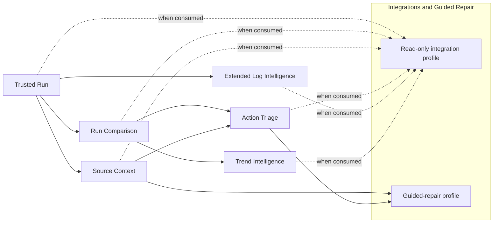

# Named capability-milestone plan

## Source publication for Task 09 baseline — 2026-10-07

The Owner requested a reviewed commit/tag/push script after the Git report.
The 2026-10-07 report confirms local and remote `main` at `450b1f71...`, no staged
work, no remote tags and no drift in the received build inputs. The publication
plan includes the received implementation, pinned retained releases, catalog/default
adoption and reviewed coordination documents, including the two dated Advisory
pilot-review documents. Runtime evidence and local configuration remain excluded.

The source pin is the annotated tag **`task09-baseline-2026-10-07`**, created on
the new reviewed commit by the owner-run script, then pushed atomically with `main`.
Before that execution, the tag is only intended. Its annotation and protected
TREK-6 completion receipt carry the actual commit/hash results without a
self-referential documentation edit. Do not infer publication from this paragraph.
See [the exact baseline](TASK09_RELEASE_BASELINE.md) for pins, script/receipt locations and verification.

Local production model order **9**, Learner order **10** and repository default
are already adopted. Package version remains **0.0.1**, algorithm **v61**; orders
are sequence numbers. Physical external installation is deferred/unperformed for
Task 10. No live switch/restart or hosted wheel upload is part of this Git script.
Earlier pending/authorization statements below are dated history; the Owner's
later request authorizes preparing this bounded remote update for owner execution.

## Task 09 baseline — 2026-10-07: publication continuation

Owner issued [the publication assignment](task09-deliverables/RELEASE_PUBLICATION_PIPELINE.md). Local production publication
and repository adoption are complete and freshly reauthenticated: wheel
`2dbb613d...`, model `2b12932103f3a3111a4e1880` (order 9), Learner `2ec4b671...`
(order 10). Orders are publication sequence numbers; package version is **0.0.1**,
Learner algorithm **v61**. [The baseline](TASK09_RELEASE_BASELINE.md) gives full pins and receipts.

The now-required local reviewed commit and annotated tag remain unexecuted:
this session's filesystem policy makes `.git` read-only, with no escalation route.
TREK-6 is continued as `in_progress` for that precise publication obligation;
prior CMT-63 completed receiving/local adoption, not the newly issued Git step.
No further owner approval is needed. Pipeline must finish in a Git-writable session
using the refreshed 193-path review; no old HEAD/tag substitution. Task 09 receiving
has no implementation defect; final publication/owner-closure readiness awaits
that source pin. Existing staged work is empty and untouched.

Operational installed selection is a separate file and still authenticates prior
package `4ac4e8ee92346e6d14eacfbf`; repository adoption does not establish running
service identity. No live switch/restart, push or upload occurred or is authorized.
External installation verification is deferred/unperformed for separately issued
Task 10. Earlier completion statements below retain their narrower historical scope.

## Latest production release published locally — 2026-10-07

The Owner has adopted this verified Task 09 application/Learner/full-model
combination as the newest production release. Model **2b12932103f3a3111a4e1880**
is published at **order 9**, Learner **2ec4b671...** at **order 10**, and the
repository default now selects the new exact manifest pin. Wheel **2dbb613d...**
and its verified isolated installation contain and select that same 73-log model.
The wheel's distribution label remains **0.0.1** and the algorithm label remains
**v61**; release hashes/catalog identities distinguish this production build.

See [the production baseline](TASK09_RELEASE_BASELINE.md) for full pins, locations, acceptance evidence,
publication receipt and rollback. Genuine installed classification and retained
Learner evaluation passed; the publication reauthenticated all 620 installed
members and both default selections. No component receiving defect remains.
TREK-2 is received; TREK-6 receiving is complete under the Owner's explicit
deferral of physical external installation verification to Task 10. That check
is unperformed, not passed. Task 10 still requires its own assignment.

Repository production publication/default adoption are executed. The running
Watcher/handler and config are unchanged; no live service switch is claimed.
Git commit/tag/push and remote upload are unexecuted: this session cannot write
`.git`, and no remote release has been created. The exact reviewed source
include/exclude and commit/tag proposal remain in the baseline evidence.
Earlier status/proposal entries below are history, superseded where inconsistent.

## Task 09 full-model baseline received; placement open — 2026-10-07

Owner-issued baseline receiving produced the fresh full-model wheel `2dbb613d...`
and isolated installation; all 620 members authenticate. New package
`2b12932103f3a3111a4e1880` / manifest `02c70654...` selects the exact 73-log model.
Installed genuine G2 classification gives 4,141 template / 65 provisional records,
with complete record equality to production; installed retained Learner evaluation
and journals pass. Unchanged Reporting/Watcher evidence is explicitly reused.
[The exact baseline and adoption proposal](TASK09_RELEASE_BASELINE.md) records identities, commands,
placement, orders 9/10, metadata/default and reviewed Git commit/tag proposal.

Learner TREK-2 is received and closed; Pipeline-only physical external placement
remains on TREK-6. Session writes are checkout-only; next owner action is authorized
external staging at `C:/Users/nateb/Documents/ck3chronicle-task09-stage` or explicit
placement disposition, then Pipeline completes that bounded check. Task 09 is not
declared closed and this requirement is not passed into Task 10. Production catalogs,
active repository selection/config, services and Git remain unchanged. Repository
adoption, source commit/tag, live activation and Task 10 issuance are separate.
Earlier preparation/status entries below remain historical.

## 09B assignments and Trekker enrollment complete — 2026-10-06

The owner accepted both Task 09 recommendations, with explicit lightweight-journal,
counting, preservation and component-boundary qualifications recorded in the
[disposition](TASK09_OWNER_DECISIONS.md). The [assignment index](CANONICAL_LOGGING_V1_DELIVERABLES.md)
packages that corrected scope for staged owner issuance. Advisory recommends no
09C because implementation and integrated receiving already have owners.
Pipeline delivered the bounded pilot. Advisory enrolled the owner's six consolidated
logging deliverables as `TREK-1` through `TREK-6`, with real dependencies/checkpoints
and verified team-state views. All await owner dispatch; next is Shared Backend/API
to Pipeline. The index links the aligned prompts and protected startup commands.
09B is complete as coordination/enrollment, not logging implementation or receiving.
No implementation dispatch or production activation occurred in 09B. This supersedes
the earlier pending-decision/enrollment wording below.

## 09B advisory preparation and owner decisions — 2026-10-06

[09B](TASK09B_PROMPT.md), led by Advisory, now prepares concrete recommended
decisions and clearly labelled draft assignments when a scope disposition is
missing. It must not stop with only a request that the owner reconstruct the
scope. [The decision brief](TASK09_OWNER_DECISIONS.md) recommends the corrected
09A logging scope and Pipeline-owned Trekker pilot setup. These remain
recommendations until accepted. Enrollment requires approved scope and the
delivered protected helper; component implementation, dispatch and activation
retain their existing authority boundaries. The prior all-or-nothing 09B entry
gate is superseded; other 09B limits remain.

## Logging and first-use delivery direction — 2026-10-05

The owner clarified that Task 09 logging requires implementation throughout the
application, with Learner leading the plan. [09A](TASK09A_PROMPT.md) now covers all
component owners and a staged delivery sequence; it still commissions planning only.
[09B](TASK09B_PROMPT.md) follows: break the plan into team-owned implementation
deliverables and begin using Trekker to track execution, dependencies, continuation
and receipt. Evaluate the need for 09C during 09B; no 09C is presumed necessary.
Trekker is independent tracking available across teams. Its bounded
[CLI pilot setup](TREKKER_CLI_PILOT_PROMPT.md) is the prerequisite to actual tracker
use in 09B; neither saving these prompts nor executing 09A activates it.

Configuration and package-selection setup are required. The owner wants someone
to download CK3Chronicle cold and start using it. [Proposed Task 10](TASK10_PROMPT.md)
therefore targets a usable installation and first-run setup, with Pipeline as
recommended lead. A Windows bundle/installer is proposed, not yet selected or
implemented. A separate doctor command is undecided; setup validation remains
necessary. This supersedes treating Task 10 as only a readiness/closure review.
The completed cutover, 31-Run rebuild/live receipt and existing accepted limitations
are inputs, not assignments to repeat. Saving these directions authorizes no
installation, publication, service restart or production change.

## Reporting content-search clarification — 2026-10-04

08B reporting implementation is delivered, including owner-review corrections.
The [current handoff checklist](TASK08B_REPORTING_HANDOFF.md) identifies the complete
deliverable set and two unexercised fault groups. Full live Trusted Run acceptance
remains separate; no additional 08B feature implementation is currently open.

Phrase/token search covers the whole diagnostic. Stored literal/slot provenance
and assigned templates are now visible result data; no separate classification or
special template-discovery query is introduced. The earlier contrived query is
withdrawn. Requested history positions, honest missing-Run display and file-I/O
verification replace the earlier demand for eleven simultaneous Runs or removing
raw logs/models. Two concrete runtime fault paths remain unexercised; normal
absence is not an operation failure. [08B](TASK08B_REPORTING_HANDOFF.md) records
the delivered corrections and genuine checks. No new milestone or dependency.

## Reporting duplicate-detection requirement removed — 2026-10-04

The owner deleted reporting's timestamp-based Run exclusion/rejection rule.
Duplicate-ingestion handling remains pipeline-owned. Reporting code, specifications
and the outstanding-check register now follow that boundary; it is not an unverified
requirement or a milestone dependency. See [08B](TASK08B_REPORTING_HANDOFF.md).

## 08B file presentation and source rule — 2026-10-04

Owner-directed labels/columns and last-load-order file/line source assignment are
delivered through the existing source, analysis and report services. Genuine CLI
and browser verification is recorded in [08B](TASK08B_REPORTING_HANDOFF.md). No new
milestone, schema, dependency or production change is involved.

## 08B relative-path clarification — 2026-10-04

Relative paths select the same location beneath each recorded playset member.
The explicit relative-path filter accepts an optional leading slash; candidate
lookup remains confined to the named parent folder. Genuine CLI, source and
presentation evidence is recorded in the [08B handoff](TASK08B_REPORTING_HANDOFF.md).
This is a bounded receiving correction, with no change to milestone scope.

## 08B no-path emission correction — 2026-10-04

The owner clarified that a pathless emission is complete by design. Source
context is not applicable to it, and no source lookup is performed when all
selected emissions are pathless. Query exports and reports now reflect this
without warnings or reference-completeness penalties. See the [08B handoff](TASK08B_REPORTING_HANDOFF.md).

## 08B source recursion measurement — 2026-10-04

Owner-requested independent recursion validation is delivered: per-search file and
folder counts, effective directories and cache use are exported and rendered.
Twenty-nine comparisons against real source-tree enumeration pass, including
recursive/nonrecursive and cached/scoped searches; the root CLI shows the counts.
[08B handoff](TASK08B_REPORTING_HANDOFF.md) records the checker correction and exact
evidence. This does not change source selection, production state or milestone scope.

## 08B explicit unresolved-path selection — 2026-10-04

Owner-requested `scope.source.resolution` now selects current resolved/unresolved
references, separately from ordinary stored-path matching. Reports expose each
reference's status. No-path records are excluded; incomplete coverage remains
unknown. This is a bounded query/source/report addition with genuine and authorized
fixture verification; [08B handoff](TASK08B_REPORTING_HANDOFF.md) has the evidence.
Stored identity, schema, production selection and Trusted Run scope are unchanged.

## 08B path-query correction — 2026-10-04

The owner's latest clarification supersedes missing-file/pathless-filter failures.
Path-only selection matches stored references and excludes nonmatches normally;
current disk existence is optional context. The source/query owners and report
examples are updated, including a broad all-diagnostics-for-path query. Genuine
CLI/library, authorized two-emission fixture and archive checks pass. See the
[current handoff](TASK08B_REPORTING_HANDOFF.md). This changes filter behavior within
the assigned libraries, not the architecture or the separate Trusted Run milestone.

## Earlier 08B verification follow-up — 2026-10-04

The owner-authorized two-entry fake-LOCATOR fixture now passes five checks through
normal capture/playset writing, disposable handler ingestion and eleven root-CLI
exports. It is labelled synthetic and preserves genuine playset membership.
Fresh genuine history supplies seven eligible Runs, verifying the full trailing
five and each five-neighbor side. Five unchanged archives separately verify all
nine syntax selectors and missing-playset behavior. No synthetic history is used.

The [current reporting handoff](TASK08B_REPORTING_HANDOFF.md) and generated
`outcomes.html` distinguish those completed checks from the five remaining evidence
gaps. Fifty-four explained examples have checked offline links and new browser
evidence. Live Trusted Run acceptance and later architecture remain separate;
production state, package selection, commits and pushes are unchanged.

## Earlier 08B reporting implementation and verification record — 2026-10-04

The remaining 08B navigation, explanation, filter and browser-verification work is
complete. [The closure matrix](TASK08B_REPORTING_HANDOFF.md) maps the assigned CLI,
five presets, reusable queries, formats, history, candidates and source appendices
to implementation and executed genuine-data/browser evidence. Valid opposing
filters return an empty set; missing required input is rejected before submission.
The example bundle has 38 explained investigations with outcome and return links.

Genuine verification uses four eligible Runs and 14 timestamp exclusions. Actual
DLC-file presentation now has CLI/browser evidence. Unrepresented failure/full-
window cases and seven absent syntax selectors remain disclosed evidence limits;
they are not fabricated or treated as passing checks. Full live Trusted Run,
configuration/bootstrap replacement and later adapters remain separate. No
production activation, commit or push was performed.

## Proposed Trusted Run completion pathway — 2026-10-03

[Advisory assessment](TRUSTED_RUN_COMPLETION_PATHWAY.md) recommends finishing 08B,
closing concrete configuration/setup/doctor gaps, then bounded integration/readiness
and candidate acceptance. Existing later full-lifecycle evidence should be received
before proposing more live work. 09A planning can proceed independently; canonical
implementation is not automatically a milestone gate. These are recommendations,
not approved replacement Tasks 09–12 or an amendment to owning specifications.

## Canonical logging direction and provisional 09A — 2026-10-03

[Canonical Logging System v1](CANONICAL_LOGGING_SYSTEM_V1.md) records the owner's
real-code/checkpoint architecture and supersedes the earlier phase-based learner
logging proposal. [09A](TASK09A_PROMPT.md) is planning only, ending with
`CANONICAL_LOGGING_V1_IMPLEMENTATION_PLAN.md`; implementation is not commissioned
by this preparation. Numbering and rollout remain for incoming-advisor/owner review.

Recommendation: plan alongside 08B, then consider a bounded shared-owner/learner
implementation, with wider runtime conversion separately justified. Do not expand
08B or automatically make logging a Trusted Run gate. The
[advisor briefing](ADVISORY_HANDOFF_TRUSTED_RUN.md) includes alternatives, receiving
ownership and source-preserving refactor guidance. No source or production changed.

Latest delivery (2026-10-03): the known-path source traversal repair is now
implemented and verified against genuine data. Only unscoped searches default to
all roots; member/directory/exact-path constraints narrow work. See the current
[08B receiving delta](TASK08A_MULTIRUN_VERIFICATION_HANDOFF.md); earlier acceptance
and open-defect statements below are superseded. Assignment prompts unchanged.

Latest source-scope decision (2026-10-03): the owner accepted whole-selected-root
inventory as the default without explicit directory scope. Code documentation
now explains it. This supersedes the default-narrowing defect classification
immediately below; receive the update through the handoff, not a rewritten prompt.

Completion qualification (2026-10-03): 08A libraries are delivered with an open
08A.2 known-path traversal-scope defect. Its assignment as 08B's first receiving
repair does not count as completed 08A.2 work. See the
[requirement reconciliation](TASK08A_MULTIRUN_VERIFICATION_HANDOFF.md) before
using older “delivered” milestone headings as an unconditional completion claim.

Current reporting correction (2026-10-03): [included-window newness delivery](TASK08A_MULTIRUN_VERIFICATION_HANDOFF.md).
Median-based comparisons and the novelty-unavailable gate were removed by owner
direction. 08B receives actual counts/fractions and newness over included
predecessors, with no replacement notability formula.

## Tasks 08A.1 and 08A.2 delivered; 08B next — 2026-10-02

[08A.2's handoff](TASK08A_2_SOURCE_SEARCH_HANDOFF.md) completes source roots,
recorded members, file/content search, all candidates and excerpts integrated
with [08A.1](TASK08A_1_DIAGNOSTIC_QUERY_HANDOFF.md). Nine source checks and six
diagnostic checks passed using real SQL/source data only. The 133-member
performance/evidence exercise is recorded; unavailable real cases remain
unverified. No synthetic checks or additional requirements were introduced.
Proceed to [08B reports and CLI](TASK08B_PROMPT.md) using both library deliveries.
Live acceptance and other excluded work remain separate. Older checkpoints below
do not supersede this delivery.

## Task 08A.1 delivered; 08A.2 next — 2026-10-02

[08A.1's handoff](TASK08A_1_DIAGNOSTIC_QUERY_HANDOFF.md) delivers reusable stored
diagnostic queries, exact identity/history, source-time Run selection/exclusions,
notability and complete pre-limit totals. After owner review, 14 synthetic or
injected reporting checks were removed; the six remaining genuine-data checks
passed. SQL integration covers one eligible Run. Multi-Run behavior and threshold
boundaries remain unverified by real data; synthetic passes are not acceptance
evidence. The seven-check synthetic logging suite was also deleted at the
owner's direction; historical handoffs must not restore it.

Execute [08A.2](TASK08A_2_PROMPT.md) against the delivered query/source interface,
then [08B](TASK08B_PROMPT.md) after actual source integration. Source-dependent
filters are explicitly unavailable until 08A.2. Live Trusted Run acceptance,
Run-result replacement and other follow-ups remain separate. No production state
was changed. Prompt-preparation checkpoints below are retained as history.

## Owner-updated reporting split — 2026-10-02

The current sequence is [08A.1 diagnostic queries/analysis](TASK08A_1_PROMPT.md),
[08A.2 playset source search/context](TASK08A_2_PROMPT.md), then
[08B reports/CLI](TASK08B_PROMPT.md). The owner's supplied revisions are the
baseline; changes are limited to task division, receiving boundaries and requested
search-library guidance. They supersede conflicting older planning text below.
Prompts are prepared, not implemented. See [the split review](TASK08_SPLIT_REVIEW.md)
for the scope mapping and separate unapplied recommendations. Documentation only;
no runtime actions or installations.

## Reporting and Analysis — 08A then 08B — 2026-09-30

The next implementation sequence is [08A library capabilities](TASK08A_PROMPT.md),
then [08B reports and CLI](TASK08B_PROMPT.md), owned by Reporting and Analysis.
Both prompts are prepared; neither implementation is claimed here. Together they
deliver filtered Run investigations, same-package exact recurrence, unresolved
all-candidate source context and optional linked excerpts. Ordering uses only
`facts.error_log_source_modified_at`; missing-time Runs are excluded and fewer
than five eligible neighbors is normal. Audit is excluded. The
[syntax research handoff](CK3_SYNTAX_DIAGNOSTICS_RESEARCH.md#concrete-selector-handoff)
supplies verified selectors for review when building that preset. See the
[decision ledger](TASK08_SCOPE_REVIEW.md) for current scope and later work.

These assignments supersede older Task 08 planning below. Full live Trusted Run
acceptance, Run-result replacement and later correlation features remain separate.

## Task 07E live activation - 2026-09-30 08:28 Hong Kong

Following owner authorization, the updated watcher was started hidden at
00:27:53 UTC. The previous PID was absent, its heartbeat was stale, the runtime
lease was free, and no old handler was listening. The exact configured database
passed read-only schema-3 verification. CK3 was already running, so the new
watcher attached to that process without interrupting the game.

Watcher PID 34340 (launcher 9792) observed CK3 PID 44816; a fresh heartbeat at
00:28:23 UTC confirmed `running`. Handler PID 308 reported `handler_ready`, with
instance `71d783fe8dc34ea6b4b0f7140de130b2`. Startup ingestion found all five
readable retained captures already stored and returned ordinary duplicate
non-completion. Twenty-two older inaccessible captures remain unavailable;
permissions were not changed. No watcher/handler ERROR events were observed;
bootstrap stderr was empty. Configuration, model selection and database identity
were unchanged; no reset or forced expiry was performed.

Evidence: ignored `.codex-tmp/task07e/activation.json`. Logs now use the 07E
paths in [the handoff](TASK07E_RUNTIME_LOGGING_HANDOFF.md). The attached game's
exit was subsequently observed at 01:26:28 UTC and ingestion completed at
01:26:36 UTC as Run `20260930-BYVZUV`, request
`3f5002c984d94334b65205052b4916ed`. Its merged trace is retained under
`.codex-tmp/task07e/live-session-20260930-BYVZUV/`. Capture and ingestion took
7.657 seconds, with no warning/error/contention events for that request.
Attachment after game startup does not establish complete observed start-to-exit
Trusted Run acceptance. Task 08 and
Run-result replacement remain separate. The following implementation-delivery
checkpoint predates this separately authorized activation.

## Task 07E delivered — activation remains separate — 2026-09-30

[Task 07E's handoff](TASK07E_RUNTIME_LOGGING_HANDOFF.md) documents the shared
standard-library logging owner, bounded UTF-8 JSONL files, watcher/request-ID
correlation, preparation/database timing, compact contention episodes, tracebacks
and durable bootstrap stderr. EventJournal preserves lifecycle vocabulary and
the replaceable heartbeat. Runtime logging failures do not change Run outcomes.
Future runtime code uses `runtime_logging.py`; run `tools/check_runtime_logging.py`.

Fresh verification passed **66 checks, no failures, errors or skips**, in 86.156
seconds: the 59 receiving checks were rerun alongside seven focused logging
checks, using genuine retained CK3 inputs and disposable storage. Static ownership,
isolated imports and `pip check` passed. This is distinct from the inherited
September 30 07D handoff's 59-check result. Evidence is ignored under
`.codex-tmp/task07e/`; the handoff records coverage and limitations.

The [07D API contract](TASK07D_DATABASE_REQUEST_HANDLER_HANDOFF.md) is preserved:
one dedicated handler, one preparation thread, one database worker, exactly three
public states, all unfinished requests plus the latest 256 terminal outcomes,
`LookupError` for unavailable results, `exception_class`, and internal-only
`cleanup_unaccepted`. Watcher `ingestion_outcome_unavailable` still creates no
outcome or eviction retry. SQL/review/playset formats and ingestion/retention
semantics are unchanged. Logging does not recover outcomes after abrupt termination.

No production configuration, selection, storage, captures or live processes were
changed; nothing was committed or pushed. The unrelated dirty tree is preserved.
Next operational step: follow the 07E handoff's separate procedure to stop the
watcher at a quiet boundary, shut down the old handler for the configured file,
verify that file read-only, and start the updated watcher. Startup ingestion and
daily retention keep their existing behavior. Task 08 SQL reports, Run-result
replacement and complete Trusted Run acceptance remain separate assignments.

## Historical checkpoints (superseded where they conflict above)

## Rejected database-handler design retired

The rejected shared-database-request-handler design and its implementation plan
are withdrawn. The design document has been deleted. Replacement implementation
instructions will be issued separately; no replacement architecture is specified
here. Existing delivered capabilities remain unchanged. See
[CURRENT_HANDOFF.md](CURRENT_HANDOFF.md) for the cleanup record.

## Watcher operational integration completed — 2026-09-29

Automatic ingestion and daily maintenance are live against the approved named
database. Current storage APIs use database terminology and explicit file paths;
see [the operational handoff](WATCHER_LIVE_ACTIVATION_HANDOFF.md). Shared pipeline
queuing, SQL reports and separately commissioned Run-result replacement remain.

## Watcher caller implemented — 2026-09-29

Post-publication ingestion, startup submission and daily maintenance are wired
and native-verified; see [the delivery](WATCHER_INGESTION_WIRING_HANDOFF.md).
Missing/invalid playsets do not reject otherwise valid error logs. The pipeline
queue and approved database naming change are separate follow-ups, not blockers
to implementing the caller. Current-schema production storage initialization,
live activation and Task 08 reports remain outstanding.

## Task 07 interfaces implemented and verified — 2026-09-28

The [Task 07 handoff](TASK07_INGESTION_AND_RETENTION_HANDOFF.md) now supplies working
ingest/retention APIs, manual ingest, schema 2, manifest 2, ordered playsets and
per-Run package lineage. Genuine native-input verification passed. The remaining
Task 07 closure choice is disposition of malformed/mismatched completed playsets;
the rejection-and-preservation proposal awaits the owner.

Next: settle that choice; watcher team wires post-publication ingestion and periodic
retention independently of new captures; Task 08 builds SQL reports. Live activation
and Trusted Run acceptance remain separate. Run-result replacement is a bounded
follow-up, not delivered here. Completed location-stack findings require no
representation change. Earlier dated “Task 07 unimplemented” entries are historical.

## Task 07 advisory checkpoint after 07C — 2026-09-28

07C is delivered; Task 07 is the next implementation assignment. Use its
[revised prompt](TASK07_PROMPT.md) and
[current decision/task ledger](TASK07_SCOPE_REVIEW.md). No new ingestion-side
learner identity or historical release recovery is needed. Raw-log expiry now
covers all completed captures, including failed/unprocessed ones, after 30 elapsed
days from capture time. Resolve malformed-playset disposition before that receiving
behavior. After Task 07, watcher-team wiring and Task 08 SQL reports can proceed
against its stable APIs; live activation and complete Trusted Run acceptance remain
separate. This is an advisory checkpoint, not an implementation-completion claim.

## Task 06B cleanup completed — 2026-09-28

The deprecated CLI/provider stack and its exclusive research/test consumers have
been removed. See [the cleanup handoff](TASK06B_DEPRECATED_CODE_CLEANUP_HANDOFF.md)
for the exact inventory, portable rollback archive, verification and limits.
`watch`, `capture`, `doctor` and `observe-logging` remain; `watch --once` remains
error-only. `harvester.py` remains the capture owner. No processing command is
active. Task 07 delivers ingest and retention APIs, one manual `ingest` command,
playset SQL storage and a watcher-team integration handoff. The watcher team owns
automatic ingest after capture and periodic retention checks, including idle periods.
See the [current scope](TASK07_SCOPE_REVIEW.md)
and [revised draft](TASK07_PROMPT.md).
Task 07 must remove the current database-wide lineage
lock and record processing versions per Run; compatible selections share one
database. Schema changes require an explicit reset, without migration or fallback.
These are instructions for implementation, not completed code. Retention eligibility
and cadence remain open. Task 08 focuses on SQL reports/read operations.
The old provider retirement, C1/C2 capture relocation/deletion proposal, parser
comparison retirement and removed-API research checks are discharged/superseded;
do not repeat them or restore compatibility providers. Task 06/v45 storage and
the watcher producer contracts remain intact, as do learner policy limitations
and the separate Script location-stack investigation. The separately authorized
live watcher was not stopped, restarted, reconfigured or used for verification.
Older dated provider-retention and cleanup-pending statements below are historical.

## Next: Task 06B cleanup, then Task 07 — 2026-09-28

The owner authorized disabling unused old CLI paths and removing their deprecated
providers before Task 07. Execute [Task 06B](06B_DEPRECATED_CODE_CLEANUP.md), then
[Task 07](TASK07_PROMPT.md) against its completion handoff.
Keep the working watcher/playset producer and capture owner `harvester.py` in place;
the earlier plan to relocate capture into `pipeline/capture.py` is superseded.
The watcher review's Section B supplies specific retirement targets. This checkpoint
records the assignment and revised prompts, not completed deletion. The live
watcher's separate operating authorization and Task 06's selected baseline remain.
Older instructions to retain unused CLI providers until cutover are superseded for
the explicit 06B scope.

## Task 06 v45 integration complete; Task 07 next — 2026-09-28

Task 06 has integrated and selected learner v45 package
`68f1ae5db205ab46afef9c4d`, model `f5cde2616f35d563118d3d32`:
model schema 5 / matcher API v2, `error-contract-v1`, SQLite schema 1.
The normal source catalog and installed wheel now use the same package.
The existing SQL design stores the new literal choices correctly; no pipeline
source edit, extra processing stage or physical database migration was needed.

Seven complete native logs passed preparation, aggregation, SQLite write/readback,
review completion and separate-process database-only rendering:
418,168 recovered occurrences,
19,912 unique records and four native review emissions.
All original 122 cases / 9,153 emissions are record-eligible. Both line-label
choices retain their exact native spelling. Duplicate rejection, generation
isolation and actual read-only SQLite failure preserve accepted state.
The installed whole-log storage path also passed with checkout resources blocked.
See [the v45 integration handoff](TASK06_V45_STORAGE_INTEGRATION_HANDOFF.md)
for exact evidence, storage mappings, changed paths and remaining limits.

The learner assessment's remaining word-run policy issues, two lost matches
against the thirty-log predecessor, capture regressions and tie behavior remain
documented; storage does not reinterpret those outcomes. Development selection
is updated, while production processing and existing application providers remain
unchanged. Next is Task 07 protected-input/processing/replay composition, followed
by Task 08 SQL-only reporting/audit. The historical learner/research retirement
dependencies in the Task 05/06 handoffs remain. No production database writes,
watcher/capture operation, retained-input deletion, commit or push occurred.

The dated selection and "integration pending" statements below retain their
historical context and are superseded by this checkpoint.

## Task 06 completed; Task 07 is next — 2026-09-27

Task 06 delivers exact-identity aggregation, current-generation SQLite Run storage,
and the native review log plus manifest for every successful Run, including zero
review. Template and provisional records remain filterable and render from stored
definitions/values. `write_run` owns staging, finalization, publication, rollback and
commit; Tasks 07/08 consume its [public APIs and detailed handoff](TASK06_RUN_STORAGE_AND_NATIVE_REVIEW_HANDOFF.md).

Three complete unmodified Task 05 inventory logs were verified in fresh ignored
generations: 199,545 recovered occurrences, 190,392 eligible occurrences, 9,396
aggregated records and 9,153 native review emissions. Verification covers exact
bytes/order/frequency, both empty-shard files, duplicate rejection, namespaces,
Run IDs/date basis, count reconciliation, real read-only SQLite rejection and
separate-process database-only rendering. The detailed handoff distinguishes
observed failures from unexercised crash/native branches and records scope proof.

Next: Task 07 protected-input preparation and processing/replay composition;
Task 08 database-only reporting/audit. Operator command choices remain for Task 07
owner review. Existing application providers remain connected until separately
commissioned cutover. Production processing remains disabled. No watcher operation,
live capture, production database write, retained-input deletion, commit or push.

Task 05's named retirement dependencies remain: the historical baseline in
`tools/template_learning/build_parser_comparison.py`, the removed-API consumer
in `inspect_cross_emission_recovery.py`, and opt-in
`test_raw_parser_requirements.py::test_independent_pipeline_replay`. Learner/model
coverage limitations remain unchanged; storage does not repair unmatched or
malformed native patterns. The current selection/package is unchanged.

All dated instructions and task orders below are historical where superseded by
this checkpoint, the approved Error Contract and the Task 06 handoff.

## Current implementation checkpoint — 2026-09-27

Task 05 is complete: the selected schema-2 package is
`44a0401b8adf0a2953d26705` (unchanged model `76630685c4a341ca14bf9c7c`).
The pipeline now executes pinned recovery and shared complete selection, binds
only selected regions once, and prepares serializable `error-contract-v1` data
with exact identity and standalone rendering. The duplicate pipeline matcher and
its bound-candidate alternatives are removed. All 31 native inventory logs and
the disposable installed path passed; see
[the implementation handoff](TASK05_ERROR_CONTRACT_IMPLEMENTATION_HANDOFF.md)
for APIs, resources, evidence, coverage limits and exact changes.

Next: Run aggregation, SQL/native-review persistence and stored reporting;
application/provider cutover remains separately commissioned. Historical
recovery/view retirement still depends on the learner comparison tool's old
baseline. Two additional research/test consumers of removed APIs are named in
the handoff. Production processing remains disabled; no watcher operation,
learner publication, commit or push occurred. Earlier sections below describe
historical checkpoints and do not supersede this completion.

Status: active project plan, updated 2026-09-27. Dated checkpoints below retain
their historical context; the active exercise section gives current task order.

## Immediate checkpoint: development restart stabilization

Status: complete as of 2026-09-11. This checkpoint does not replace or accept a
capability milestone. It restored a safe development/operations baseline for
Trusted Run.

Exit conditions:

1. current status, handoff, repository boundary, and owner decisions agree;
2. watcher capture-only behavior passes the new requirement-derived checks;
3. all 22 protected legacy captures and their one-time metadata/exception
   conversion are rehearsed on a verified disposable runtime copy;
4. the first failing pending-processing stage is isolated and corrected, and
   each capture can be processed without risking unrelated pending evidence;
5. database integrity and stored-result reconciliation pass after rehearsal;
6. production execution and watcher restart are separately deliberate; and
7. the complete reboot worktree is reviewed, committed, and pushed from the
   canonical repository.

Production `process-pending` is disabled during this checkpoint. Capturing new
`error.log` files does not authorize background processing.

Current evidence: conditions 1 and 2 are satisfied in the working tree. The
historical-session stall portion of condition 4 is isolated and corrected with
a successful, durably logged rehearsal of the affected retained input. The
22 protected originals have been recovered into a verified readable disposable
copy, and all 22 metadata records plus seven exception attachments were
converted there. All 22 captures completed the new exact-one-item path as
session/Run IDs 39–60. A deliberate mid-transaction interruption restored the
prior committed state through ordinary SQLite recovery and completed on an
exact-session retry. Final archive, lineage, counter, duplicate-hash,
`quick_check`, and foreign-key reconciliation passed, so conditions 3 through
5 are satisfied. Condition 7 is satisfied: the complete reboot tree was
reviewed, externally bundled, published as a clean canonical `main`, and
verified against the live remote. The production and watcher actions remain
separate explicit decisions under condition 6. Dated recovery evidence is in
`DEVELOPMENT_RESTART_AUDIT_2026-09-08.md`; continuation state is in
`CURRENT_HANDOFF.md`.

## Active exercise: classification pipeline recovery

Status: owner-authorized as of 2026-09-11.

2026-09-27 checkpoint: Task 04 is complete and the owner approved the
[Error Contract](ERROR_CONTRACT_SPECIFICATION.md). The next implementation is
[revised Task 05](05_ERROR_CONTRACT_IMPLEMENTATION.md), using the
[Task 04 handoff](TASK04_ERROR_CONTRACT_HANDOFF.md). This current contract and
prompt supersede older contract/routing instructions in the dated prompt sets.
The [Task 04(B) audit](04B_PIPELINE_PROCESSING_AUDIT_RESULTS.md) is complete.
Following review and [independent shared-matcher verification](SHARED_MATCHER_PIPELINE_VERIFICATION.md),
the owner assigned package integration, selected-only binding and duplicate-matcher
retirement to Task 05, alongside contract/result, identity and rendering helpers.
Task 05 also selects the verified package after integration and verifies installed
resources. Aggregation, SQL/review persistence and application cutover remain
subsequent work. The current Task 05 prompt supersedes the earlier review hold.

The ratified target removes the legacy regex taxonomy, semantic-projection
layer, schema migration/backfill paths, compatibility aliases, silent
fallbacks, and superseded in-repository model revisions. Work proceeds through
`classification_pipeline_recovery_prompts/MASTER_ORCHESTRATOR_PROMPT.md` and
numbered mini-projects 01 through 08. Each mini-project must leave genuine
captured CK3 logs operationally processable; storage-writing proof uses a fresh
disposable database. Historical tests, synthetic fixtures, and exact old model
cluster membership do not establish acceptance.

Production `process-pending` remains disabled. The watcher is capture-only and
its startup is a separate operational decision.

## Planning rule

Milestones are semantic outcomes, not an ordinal roadmap. Implementation may
exist before acceptance, and acceptance may exist before public release. A
later capability may enter implementation only when its named dependencies
are satisfied and its own detailed specification is ratified.

## Dependency graph

Source Context may proceed independently of Run Comparison after Trusted Run.
Extended Log Intelligence needs accepted Trusted Run architecture plus a
separately ratified log-research result. A read-only integration depends only
on the accepted capabilities it consumes. Guided repair depends on the exact
accepted Source Context and Action Triage prerequisites its workflow uses.
Extended Log Intelligence and Trend Intelligence are not universal integration
prerequisites.

## Cross-cutting ledgers

| Ledger | States and meaning |
|---|---|
| Implementation maturity | Absent, scaffolded, partial, functionally complete, or hardened. |
| Product support | Internal, advanced/developer, provisional, supported, deprecated, or removed. |
| Milestone acceptance | Not entered, candidate in qualification, accepted, or superseded. |
| Public release | Unreleased, preview/alpha, beta, stable, deprecated, or unsupported. |
| Model promotion | Candidate, under review, approved, rejected, or retired. |

No ledger changes another automatically.

## Universal later-milestone entry rule

Before software development begins for any milestone after Trusted Run, the
owner must ratify a detailed specification covering:

- user problem and operator journeys;
- included/excluded scope;
- individually defined functional requirements with stable semantic IDs;
- invariants and public/advanced/internal interfaces;
- data and retention consequences;
- errors, recovery, migration, and compatibility;
- requirement-derived acceptance checks;
- milestone and release relationship.

Until that gate passes, implementation remains provisional groundwork, no
acceptance suite is active, and no task may infer missing requirements or
future tests without a new owner-directed requirement.

## Trusted Run

Stable ID: `MILESTONE-TRUSTED-RUN`

Operator outcome: after explicit root configuration, either one observed CK3
start-to-exit lifecycle or one explicit manual/recovery capture turns a valid
nonempty `error.log` into durable, compact, classified diagnostic history in
the operational production database, with one Run ID, one native review shard,
and on-demand human/structured database reports. Manual capture does not invent
lifecycle facts.

Entry conditions:

- owner intent, vocabulary, exact functional requirements, architecture,
  interface/data/retention, model-quality method, and test authority are
  ratified;
- diagnostic-record identity and native-review-shard physical contract are
  approved;
- representative real CK3 evidence is available outside Git for verification;
- no evaluator or release candidate is required to begin implementation.

Exact scope and acceptance are in `TRUSTED_RUN_SPEC.md`. The production database is an
implemented acceptance prerequisite, not a conceptual assignment.

Current maturity:

| Capability | Current evidence | Target support at acceptance |
|---|---|---|
| Explicit root configuration, diagnosis, and initialization | Partial | Supported core; exact `--config` or one fixed LocalAppData bootstrap, user paths file is sole root authority, `doctor` read-only, no discovery/fallback |
| Lifecycle observation and `error.log` capture | Copy-first one-log capture and watcher lifecycle are implemented | Supported core after controlled real-session verification |
| Run-ID content-hash guard and input boundary | Implemented in source; verification pending | Supported core; every ingest route rejects an existing `error.log` hash loudly before parsing/Run-ID creation, with no override; missing/unreadable/unstable/empty source also fails loudly |
| Crash signal and exception attachment | Partial with conflicting old behavior | Supported after categorical correction |
| Run registration/recovery | Hardened or functionally complete by seam | Supported core |
| SQLite schema/open/audit | Current storage exists; migration path is superseded | Supported core through exact-current create/open and rebuild-only generation |
| Log-emission recognition | Hardened lexer under current internal naming | Supported core mechanism |
| Persistent-reader multi-error split | Functionally complete focused groundwork | Supported only after splitter behavior is verified against genuine captured logs |
| Diagnostic-record aggregation identity | Partial/overlapping current issue storage | Supported after identity design and fresh-schema rebuild |
| Classification and typed validation | Functionally complete | Supported core mechanism |
| Native review shard | Absent; current review reads uncertain DB rows | Supported core after one-shard-per-successful-run implementation |
| On-demand DB reporting | Functionally complete groundwork | Supported after schema/output narrowing and raw-path non-access proof |
| Source/review/database retention, pruning, backup/restore | Partial | Supported core after completion |
| `Mounted Data:`, comparison, source resolution, triage | Existing later groundwork | Provisional; no Trusted Run credit |

Milestone acceptance requires every `TRUSTED-RUN-*` check to pass together
against one identified candidate/revision set, ordinary regressions to remain
green, and the exact model/contract set to have a separate approved promotion
record.

Public-release relationship: accepted Trusted Run is eligible for a public
0.1 alpha only after the alpha release-readiness profile passes.

Migration/rollback: configuration, lifecycle capture, input validation,
parser/aggregation, database, native-review-shard, retention, CLI, crash,
report/output, and production-test changes require separately
authorized implementation groups with verified backup, reconciliation, and
rollback.

## Run Comparison

Stable ID: `MILESTONE-RUN-COMPARISON`

Provisional operator outcome: compare selected retained runs/baselines and see
new, fixed, worse, improved, unchanged, crash-state, and visible
acknowledged-noise results without deleting underlying diagnostic history.

Dependencies: accepted Trusted Run, stable diagnostic-record identity and
model lineage, and a ratified Run Comparison detailed specification.

Working scope to take into detailed design:

- latest/previous, selected/selected, and selected/named-baseline queries;
- exact comparison identity and occurrence-count semantics;
- crash-state change;
- model/contract compatibility and common-revision behavior;
- visible acknowledged-noise annotations/default filters that never change
  auditable totals;
- on-demand human/structured comparison reports;
- persistence only for baselines, annotations, compatibility, and measured
  caches—not every generated comparison.

Current comparison/baseline/ignore code and regression tests are substantial
provisional groundwork. They confer no supported behavior until detailed
requirements and acceptance checks are ratified. The later specification must
also define what happens when database retention removes a referenced run.

Public-release relationship: may support a later preview/beta; no stable claim
is implied.

## Source Context

Stable ID: `MILESTONE-SOURCE-CONTEXT`

Provisional operator outcome: resolve a supported diagnostic reference against
approved active-runtime/override semantics and report instances, winner/merge
meaning, observation time, uncertainty, and user overrides without causal
overclaim.

Dependencies: accepted Trusted Run and a ratified Source Context detailed
specification.

The first required design deliverable is the targeted `debug.log` `Mounted
Data:` specification. Before supported implementation begins it must define:

- the exact operator question and user value;
- grammar and extracted fields;
- `debug.log` acquisition/copy timing relative to the CK3 lifecycle, complete
  publication behavior, and explicit manual/recovery acquisition if supported;
- absent, malformed, truncated, and ambiguous behavior;
- retention and temporal meaning, including behavior when the protected
  `debug.log` copy has expired;
- authority limits and read-only boundaries;
- explicit non-implication that `debug.log` is a general diagnostic stream.

Working later scope may include exact-path replacement, named merge domains,
current-versus-stored observations, unavailable/out-of-scope states, and
explicit reversible overrides. No domain—on-action, culture, or otherwise—is
accepted merely because an old plan or prototype mentions it.

Current six-state `Mounted Data:` parsing, exact-path resolver, fingerprints,
and file-instance logic are provisional groundwork protected by ordinary
regression tests. They receive no Trusted Run or Source Context acceptance
credit until the detailed gate passes.

Public-release relationship: potential beta capability; stable relationship
remains part of owner boundary selection.

## Action Triage

Stable ID: `MILESTONE-ACTION-TRIAGE`

Provisional operator outcome: provide bounded, explainable investigation
priorities and cautious recommendations—or an explicit no-recommendation
result—from accepted run, comparison, and source-context inputs.

Dependencies: accepted Trusted Run and the exact accepted Run Comparison and
Source Context capabilities consumed by the future policy, plus a ratified
Action Triage detailed specification.

Working design topics:

- permissible evidence factors and contradiction handling;
- explicit confidence and limitations;
- separation of diagnostic-review debt from mod/game investigation priority;
- required no-recommendation behavior;
- deterministic human/structured views;
- no automatic edits or causal certainty from correlation.

Current triage ranking/source-link code is partial provisional groundwork.
Detailed requirements must decide whether workspace/Git evidence is needed;
old plans/tests cannot decide it by implication.

Public-release relationship: Action Triage remains the recommended stable 1.0
capability boundary, subject to a complete detailed specification and a future
owner release-boundary decision.

## Extended Log Intelligence

Stable ID: `MILESTONE-EXTENDED-LOG-INTELLIGENCE`

Provisional operator outcome: approved stable sections or message families in
`debug.log`, `game.log`, or another log answer a concrete operator question
that `error.log` cannot answer.

Dependencies: accepted Trusted Run architecture, completed research/design,
owner-approved operator need, and a ratified detailed specification.

Mandatory research before development:

1. analyze representative real logs;
2. identify operator questions not already answered by `error.log`;
3. select only specific stable sections/message families;
4. define source-specific grammars and compact stored fields;
5. measure value, frequency, noise, storage, and maintenance cost;
6. obtain owner approval.

Blanket parsing and indefinite whole-log storage are excluded. Existing capture
of `debug.log`/`game.log` is provisional implementation evidence only. Targeted
`Mounted Data:` work remains owned by Source Context.

Public-release relationship: optional later capability, not required for the
recommended stable boundary unless separately decided.

## Trend Intelligence

Stable ID: `MILESTONE-TREND-INTELLIGENCE`

Provisional operator outcome: provide recurrence, stability, regression, issue
history, and supported file history over retained database records.

Dependencies: accepted Run Comparison, sufficient bounded database history,
and a ratified Trend Intelligence detailed specification.

Working scope:

- recurrence windows and first/last-seen semantics;
- model/contract discontinuities and unavailable states;
- optional measured indexes, caches, or materialized summaries;
- exact cache-to-source-query equivalence;
- no dependence on indefinite exact source logs and no redefinition of
  historical diagnostic records.

Durable run data and comparison queries are groundwork. Specialized trend
structures are absent and must not be added speculatively.

Public-release relationship: optional later stable feature.

## Integrations and Guided Repair

Stable ID: `MILESTONE-INTEGRATIONS-GUIDED-REPAIR`

This combined milestone requires at least two separately ratified acceptance
profiles, or it may later split without changing the named capability system.

### Read-only integration profile

Provisional outcome: an IDE or governed agent consumes bounded stable outputs
for exactly the accepted capabilities it requests. Dependencies are only those
consumed capabilities and their supported interfaces.

### Guided-repair profile

Provisional outcome: a governed tool prepares an evidence-based repair
proposal with preview, explicit approval, and rollback. It depends on the exact
accepted Source Context and Action Triage inputs its policy uses.

Both profiles require detailed interface, permission, privacy, capability
negotiation, provenance, approval, and compatibility specifications. The
standalone CLI/database must remain fully usable with adapters absent.
Deterministic CLI JSON is only an eventual seam; no supported adapter or repair
workflow exists.

Extended Log Intelligence and Trend Intelligence are dependencies only when a
specific integration consumes them.

Public-release relationship: optional post-1.0 capability under the current
recommendation.

## Recommended release sequence

| Release label | Capability boundary | Additional condition |
|---|---|---|
| 0.1 alpha/preview | Trusted Run accepted | Alpha release-readiness profile passes. |
| Later preview/beta | One or more later milestones accepted | Advertised interface/docs/support checks pass for only those capabilities. |
| Stable 1.0 | Action Triage and the exact accepted dependencies its policy consumes | Stable release-readiness profile passes. |
| Post-1.0 | Any optional accepted capability | Only that capability/profile is added to the support promise. |

The stable boundary remains an owner decision. No later milestone may begin
software development from this high-level plan alone.
