# Trusted Run functional specification

Status: active first-capability specification as of 2026-08-31.

## Milestone identity and outcome

Stable ID: `MILESTONE-TRUSTED-RUN`

Operator outcome:

> A user explicitly configures ck3chronicle, the watcher observes one complete
> CK3 start-to-exit lifecycle, the product captures and validates that run's
> live-root `error.log`, stores compact diagnostic history in the operational
> production database, finalizes one native review shard, and generates human
> and structured reports by querying the database.

Milestone acceptance proves this capability on one identified candidate. It
does not prove clean-machine installation or public-release readiness.

## Non-negotiable database requirement

> **The production database is a required implemented capability of Trusted
> Run. Trusted Run cannot be accepted until ck3chronicle can initialize and
> reopen the database, process a completed `error.log` run into it, and
> generate the supported Trusted Run reports from the stored records without
> requiring the original `error.log`.**

This specification defines the target. It authorizes no implementation or
migration.

## Included capability

- one explicit user-configured paths file and central configuration authority;
- no filesystem, registry, Steam, Documents, sibling-repository, environment,
  or conventional-default path search;
- read-only `doctor`, explicit path configuration, and explicit initialization;
- automatic capture only after an observed configured CK3 process completes a
  valid start-to-exit lifecycle;
- a full-file `error.log` content-hash guard on every ingest route;
- loud input failure for missing, unreadable, unstable, or empty `error.log`;
- a representative genuine nonempty CK3 no-diagnostic log as the zero-
  diagnostic success case;
- new-folder crash signal and root `exception.txt` attachment state;
- deferred processing of the protected pending copy;
- an initialized, reopenable, versioned production SQLite database;
- recognized `error.log` emissions, approved source-specific multi-error
  splitting, conservative classification, and compact diagnostic aggregation;
- exactly one finalized native review shard per successfully processed run;
- lightweight review emission count/reference/availability/hash metadata in SQLite;
- on-demand human and structured reports that query the database only;
- read-only audit; bounded raw-log, review-shard, and database retention;
  transactional pruning; backup and restore;
- separate model-quality promotion for the exact runtime model/contracts.

## Explicitly excluded

- automatic capture without an observed CK3 start-to-exit lifecycle;
- periodic re-ingestion, directory-change-only capture, or inferred runs from
  old files;
- successful processing of a missing, unreadable, unstable, or zero-byte
  `error.log`;
- path search, autodiscovery, registry probing, or fallback default roots;
- general capture, parsing, or database storage of `debug.log` or `game.log`;
- `debug.log` `Mounted Data:` interpretation, owned by Source Context;
- access to crash-folder principal-log copies;
- permanent per-emission database rows merely to prove completeness;
- full native review payload duplicated into diagnostic-record tables;
- reports that parse, reopen, or depend on raw logs;
- cross-run comparison, source resolution, triage, integrations, source edits,
  automatic service installation, or any release declaration.

Existing later-capability code may remain provisional without earning Trusted
Run acceptance credit. Verification is derived after the owning specification
is ratified.

## Explicit configuration and setup requirements

`REQ-CONFIG-001`: all operational roots come from one explicit user-configured
paths/configuration file. Trusted Run requires at least the CK3 live-logs root,
CK3 crashes root, and ck3chronicle application/data root. Later approved roots
enter through the same authority.

`REQ-CONFIG-007`: the configuration file itself has one non-search bootstrap
rule. An explicit `--config <path>` opens only that exact file. Without the
option, ck3chronicle opens only the fixed application-owned Windows LocalAppData
path `ck3chronicle/paths.toml` (resolved through the Windows LocalApplicationData
known-folder API). No alternate filename, parent, legacy location, environment
guess, or filesystem/registry/Steam/Documents search is attempted.

`REQ-CONFIG-002`: initialization prompts for or accepts explicit values for
every required root, writes the supported paths file, validates the configured
locations, and initializes storage/database only after validation succeeds. A
noninteractive route may accept explicit arguments or a supplied file but may
not search.

`REQ-CONFIG-003`: the setup contract classifies each path as pre-existing and
readable, creatable, writable, internally derived, or optional for the current
milestone. Derived subdirectories come only from the configured data root.

`REQ-CONFIG-004`: `doctor` is read-only. Base/watch readiness validates
configuration presence/syntax, required keys, file-versus-directory type,
configured-root existence/readability/writability, live-logs-root access,
crashes-root access when enabled, database/data-root readiness, approved model/
contract readiness, and retention configuration. It does not require a current
`error.log` before the first completed CK3 run. An explicit manual capture or
process operation validates its requested file under `REQ-INPUT-001` through
`REQ-INPUT-004`.

`REQ-CONFIG-005`: missing, corrupt, incomplete, wrong-type, nonexistent,
moved, or inaccessible configured paths cause operational commands to fail
closed. `doctor` reports the specific fault; no filesystem/registry/default-
location search or inferred fallback occurs.

`REQ-CONFIG-006`: every operational code path obtains roots through the central
configuration module/global constants populated from the user paths file. No
other module hardcodes or reconstructs canonical locations.

`REQ-DATABASE-001`: after required path validation, initialization from an
empty configured data root is idempotent and creates the minimum versioned
production database/storage structure. Ordinary users issue no SQL.

## Lifecycle-triggered capture and content-hash guard

`REQ-CAPTURE-001`: the watcher initiates automatic capture only after it
observes the configured CK3 process complete one valid start-to-exit lifecycle.
One lifecycle triggers one capture and one run-processing attempt. No observed
lifecycle means no automatic capture.

`REQ-CAPTURE-002`: automatic capture is never triggered by file existence,
isolated directory change, polling, old retained files, retry, restart, or
reconciliation. A manual/recovery capture is an explicit operator action and
still obeys input validation and duplicate protection. It records manual or
recovery mode and does not invent a watcher lifecycle.

`REQ-CAPTURE-003`: the time-critical path protects the live-root `error.log`
before hashing, database work, parsing, classification, reporting, or
enrichment. Publication is complete or explicitly failed/incomplete; partial
bytes are never success.

`REQ-CAPTURE-004`: one observed process exit invokes one copy attempt. Watcher
restart does not retroactively create another observed exit, and the watcher
stores no separate lifecycle identity or receipt.

`REQ-CONTENT-HASH-001`: every successful Run ID stores its full-file
`error.log` content hash as metadata. Before any registration or parsing,
compare the new protected log against existing Run-ID hashes. An exact match
fails loudly and creates no new Run ID.

`REQ-CONTENT-HASH-002`: the rule applies equally to watcher, manual,
recovery, and offline ingestion. There is no override. Raw-log expiry does not
remove the Run ID's hash metadata.

## Input validation

`REQ-INPUT-001`: missing, unreadable, or zero-byte `error.log` fails loudly
with an actionable error and creates no successful diagnostic run.

`REQ-INPUT-002`: the watcher consumes only the configured Paradox-managed live
`error.log` following an observed lifecycle. It is not an arbitrary file-import
queue and does not promise adversarial validation of fabricated CK3-owned
directory contents. Manual/offline import is a separate explicit capability.

`REQ-INPUT-003`: a genuine nonempty CK3 `error.log` with supported metadata/
structure and no diagnostic emissions is accepted and creates a zero-
diagnostic stored run. Its fixture must be representative real CK3 evidence;
if absent, fixture acquisition is an explicit task and the shape is not
invented.

`REQ-INPUT-004`: if a protected Paradox-produced source cannot be processed,
the attempt fails explicitly rather than silently disappearing or becoming a
normal success. This does not create an adversarial malformed-input promise.

`REQ-INPUT-005`: every valid `error.log` is processed completely as supplied,
regardless of entry count. No particular count defines a separate input class,
processing path, report/audit branch, test, benchmark, performance case, or
acceptance gate. CK3's producer-side limit must not be mistaken for truncation
performed by ck3chronicle.

An operational failed-attempt log may record input failure but remains outside
successful run history.

## Crash facts

`REQ-CRASH-001`: only a newly created timestamped crash folder associated with
the observed lifecycle is affirmative crash-folder evidence. Modification or
mere presence of an old folder is not a signal. The watcher does not treat the
crash directory as an arbitrary ingestion queue.

`REQ-CRASH-002`: after live-root `error.log` protection, a crash run attempts
bounded capture of root `exception.txt` and records `captured`, `absent`, or
`unavailable`; a normal run records `not_applicable`.

`REQ-CRASH-003`: crash-folder copies of `error.log`, `debug.log`, and
`game.log` are never opened, compared, hashed, copied, registered, retained,
substituted, exposed, parsed, or tested as product inputs.

`REQ-CRASH-004`: stored/emitted observed facts contain no inferred loading,
gameplay, or other lifecycle stage.

## Run processing and recovery

`REQ-RUN-IDENTITY-001`: each successfully processed watcher-observed lifecycle
capture or explicit manual/recovery capture has one stable run ID and
chronology. A watcher run derives from its observed lifecycle and successful
processing record. A manual/recovery run derives from its explicit capture
attempt and successful processing record; it does not invent lifecycle facts.

`REQ-RUN-IDENTITY-002`: store capture mode and capture time for every run,
observed process start/exit times only when actually observed, and first/last
diagnostic timestamps when available. Manual/recovery lifecycle facts may be
unknown and remain unknown.

`REQ-RECOVERY-001`: finalization, registration, parsing, classification,
aggregation, review-shard publication, and database commit expose the prior
accepted state or the complete new state. Retry/reconcile never manufactures a
second run for the same observed lifecycle or explicit capture attempt.

`REQ-RECOVERY-002`: one failed/corrupt historical item is reported precisely
and does not silently block unrelated work. Batch operations report per-item
outcomes and overall non-success when any requested item fails.

## Emissions, multi-error formats, and no-silent-loss control

`REQ-LOG-EMISSION-001`: one log emission begins at a recognized timestamp-
prefixed CK3 `error.log` header and includes continuation lines until the next
recognized timestamp-prefixed header.

`REQ-LOG-EMISSION-002`: two recognized headers are two emissions even with
identical timestamp values. Preamble/malformed material follows an explicit
parser-error contract.

`REQ-LOG-EMISSION-003`: after input-format validation, every recognized
emission produces one or more recovered diagnostics, is written to the run's
native review shard, or produces explicit parser failure. Nothing silently
disappears.

`REQ-LOG-EMISSION-004`: run counters cover emissions seen, ordinary emissions,
multi-error emissions, diagnostics recovered, review emissions written, and
parser failures. Exact names may differ; reconciliation may not.

`REQ-MULTI-ERROR-001`: the default is one emission to one recovered diagnostic.
Multiple recovery requires an approved source family/message grammar,
representative fixtures, deterministic boundaries, and exact count/value tests.

`REQ-MULTI-ERROR-002`: the initial known case is the
`pdx_persistent_reader.cpp` wrapper with repeated clauses such as `Unknown
trigger:` or `Failed to read key reference:`. Unapproved long messages are not
guessed apart.

`REQ-MULTI-ERROR-003`: source/child ordinals may be transient parser/QC
provenance. No permanent parent-emission database model is required.

## Diagnostic records and classification

`REQ-DIAGNOSTIC-IDENTITY-001`: before database implementation/migration,
approve deterministic diagnostic-record identity over every meaning-bearing
contract field, including contract revision, typed slots, relevant file, and
contract-defined line/symbol/locator values.

`REQ-DIAGNOSTIC-IDENTITY-002`: volatile repetition metadata does not split
equal records. Equal identities within one run aggregate into one diagnostic
record with `occurrence_count` and first/last observed timestamps.

`REQ-CLASSIFICATION-001`: an approved hash-bound model and reviewed contracts
classify recovered diagnostics. Similarity nominates; typed validation
authorizes.

`REQ-CLASSIFICATION-002`: approved full or explicitly permitted partial/L1
results create/update compact diagnostic records with contract revision and
typed slots. Stable text renders from the versioned contract.

`REQ-CLASSIFICATION-003`: provisional, low-confidence, and unresolved results
do not become confident diagnostic records. Their original emissions route to
the run's native review shard with reason/provenance.

`REQ-CLASSIFICATION-004`: record application, parser/splitter/normalizer,
model, contract, and schema revisions required to interpret results. Failed
approved refresh preserves prior accepted state.

## Production database and review-shard separation

`REQ-DATABASE-002`: schema versioning and supported migrations are explicit,
transactional, restart-safe, compatibility-checked, and recoverable.

`REQ-DATABASE-003`: Trusted Run durably represents run chronology, crash facts,
compact diagnostic records/counts, approved lineage, processing counters,
review emission count/reference/availability/hash, retention/audit state, and reportable
query inputs.

`REQ-DATABASE-004`: missing, unreadable, empty, invalid, unavailable, corrupt,
expired, and pruned states are explicit in the appropriate failed-attempt or
successful-run domain. No retained row/manifest has a dangling reference.

`REQ-DATABASE-005`: SQLite is not a raw-emission archive. Complete unresolved
native payload stays in the per-run shard, not diagnostic-record tables.

`REQ-REVIEW-SHARD-001`: each successfully processed run has exactly one
native-format review shard, including an empty finalized shard when no emission
requires review. It is separate from complete raw `error.log` and compact
approved diagnostic records.

`REQ-REVIEW-SHARD-002`: the shard preserves substantially native routed
emissions, frequency, and provenance for run ID, source family, application/
parser/model revision, routing reason/confidence, finalization, and integrity.
Whole-shard lossless compression after finalization is permitted.

`REQ-REVIEW-SHARD-003`: shard publication finalizes transactionally with the
run-processing result. SQLite cannot claim review availability before safe
publication and stores only lightweight review emission count, shard reference,
availability, and shard hash.

## Database-only reports

`REQ-REPORT-001`: human and structured reports query the operational production
database only. They never parse, reopen, or depend on a raw `error.log` path.

`REQ-REPORT-002`: reports identify application version, database/output schema,
represented model/contracts, generation timestamp, selected runs/range, query
filters/order, and relevant completeness limitations.

`REQ-REPORT-003`: fixed database state, code revision, and query parameters
produce deterministic ordering/meaning, and human/structured views agree.

`REQ-REPORT-004`: a report states review emission count, shard availability, and
relevant parser/model revision without embedding every native review emission.

`REQ-SOURCE-DEPENDENCY-001`: raw-source availability matters only for explicitly
source-dependent operations such as exact whole-log reparse, byte-level audit,
or original-file export. Such operations report unavailability when invoked;
ordinary reports are unaffected because they never access raw logs.

## Audit, retention, pruning, backup, and restore

`REQ-AUDIT-001`: standard audit is read-only and detects foreign-key damage,
orphans, broken shard references/hashes, invalid revisions, contradictory
counters/states, duplicate content hashes, and retention damage. Deep raw-byte
audit is explicit and may report source unavailable.

`REQ-SOURCE-RETENTION-001`: exact raw `error.log` defaults to one week and is
configurable by duration, storage allocation, or both. Eligibility begins only
after database/shard commit. Raw expiry removes the retained source bytes but
not the content-hash metadata attached to the successful Run ID.

`REQ-DATABASE-RETENTION-001`: derived database history is bounded by configurable
retention period, maximum allocation, or both. Safe finite defaults are
ratified after compact-record growth measurement.

`REQ-DATABASE-RETENTION-002`: preview and explicit execution prune oldest
eligible complete runs transactionally until configured limits pass, with
reference reconciliation and estimated/actual effect. The same recoverable
prune workflow removes every raw source, crash attachment, and native review
shard owned solely by each deleted run.

`REQ-DATABASE-RETENTION-003`: database pruning leaves no dangling references,
runs audit, and supports explicit compaction/backup/rollback behavior. A review
shard may expire before its database run, but it never silently outlives a
deleted run unless explicitly exported or promoted into a separately governed
learner corpus.

`REQ-REVIEW-SHARD-RETENTION-001`: review shards have configurable period and
maximum allocation. **90 days and 2 GiB, whichever requires earlier FIFO
deletion**, is an owner-accepted measurement candidate materially longer than
raw-log retention, not an active default; representative shard-growth evidence
and a later owner decision are still required.

`REQ-REVIEW-SHARD-RETENTION-002`: remove oldest eligible finalized shards FIFO
when age and/or size limits require it; stage deletion recoverably, update
database availability truthfully, preserve review emission counts, audit, and leave
no broken reference or hidden unlimited store.

`REQ-EXCEPTION-RETENTION-001`: root `exception.txt` attachments have a
configurable bounded retention policy, but no numeric default is active before
representative size/use measurement and owner decision. The preferred policy
candidate retains an attachment with its native review shard or until its
associated database run is pruned, whichever occurs first. Database-run
pruning always removes an attachment owned solely by that run in the same
recoverable prune workflow.

`REQ-BACKUP-001`: backup includes a consistent database, retained raw logs/
hash inventory, attachments, review shards/sidecars, configuration, and a
manifest. Restore verifies configuration paths, schemas, hashes/references,
report generation, and audit.

## Target operational pipeline

```mermaid
flowchart LR
    BOOT["--config exact path or one fixed LocalAppData file"] --> CFG["Explicit user paths file"]
    CFG --> VAL["Validate configured roots; live error.log not required"]
    VAL --> MODE{"Capture mode"}
    MODE -->|"Watcher"| WATCH["Observe configured CK3 process start"]
    WATCH --> EXIT["Observe matching process exit"]
    EXIT --> CAP["Protect requested/live-root error.log"]
    MODE -->|"Explicit manual/recovery"| MANUAL["Validate requested error.log; lifecycle may be unknown"]
    MANUAL --> CAP
    CAP --> HASH["Hash retained raw log"]
    HASH --> DUP{"Hash already retained?"}
    DUP -->|"Yes"| ANOM["Reject input; create no Run ID"]
    DUP -->|"No"| FORMAT["Validate CK3 error-log format"]
    FORMAT -->|"Invalid"| FAIL["Loud failed attempt; no successful run"]
    FORMAT -->|"Valid"| EMIT["Recognize log emissions"]
    EMIT --> DIAG["Recover diagnostics"]
    DIAG --> CLASS{"Approved contract?"}
    CLASS -->|"Yes"| REC["Aggregate diagnostic records"]
    CLASS -->|"No/uncertain"| SHARD["Per-run native review shard"]
    REC --> DB[("Operational production database")]
    SHARD --> FINAL["Finalize shard with run result"]
    FINAL --> DB
    DB --> REPORT["Human/structured reports query DB only"]
```

## Current implementation evidence and required audit

| Target responsibility | Current evidence | Planning disposition |
|---|---|---|
| Lifecycle observation/capture | Watcher and copy-first capture foundations exist. | Verify exact exit-only capture against a real CK3 lifecycle. |
| Configuration | Central project configuration and root containment exist, but the target exact-`--config`/fixed-application bootstrap is not implemented. | Implement the target bootstrap and derive focused verification; no alternate-file or root fallback search. |
| Full-file hash | Current capture/archive hashing foundations exist. | Use only for retained-raw duplicate/integrity guard; no indefinite history or crash comparison. |
| Emission recognition | `parser/log_blocks.py` streams timestamp-led units. | Reuse after input-format validation. |
| Multi-error | Current classifier has persistent-reader multi-result groundwork. | Verify approved splitting against representative real CK3 evidence. |
| Operational SQLite | Current schema/migrations/report queries are substantial. | Migrate rather than redesign greenfield. |
| Native review | Current review queries use uncertain DB rows/samples. | One shard per successful run is approved but not implemented. |
| Reporting | Current reports query database rows. | Derive minimal database-only proof from the ratified report requirement. |

## Trusted Run acceptance checks

Every check passes together against one identified application, database,
configuration schema, parser/splitter, model/contract, and output revision.

| Acceptance ID | Exact check |
|---|---|
| `TRUSTED-RUN-CONFIG-01` | Initialization prompts for every required operational root, writes the explicit paths configuration, validates it, and initializes the application only after the configured paths are correct. |
| `TRUSTED-RUN-CONFIG-02` | `doctor` confirms readiness from valid configured paths and performs no mutation or path discovery. |
| `TRUSTED-RUN-CONFIG-03` | Missing, corrupt, incomplete, nonexistent, wrong-type, or inaccessible configured paths cause operational commands to fail closed; `doctor` reports the specific fault and no fallback search or inferred root is used. |
| `TRUSTED-RUN-CONFIG-04` | After successful setup, deletion or corruption of the paths file or removal of a configured root causes the application to fail closed until the explicit configuration is repaired. |
| `TRUSTED-RUN-CONFIG-05` | With `--config <path>`, only that exact configuration file is opened. Without it, only the fixed Windows LocalAppData `ck3chronicle/paths.toml` file is opened. Instrumented alternate-file traps prove no discovery or search. |
| `TRUSTED-RUN-CONFIG-06` | Base/watch `doctor` readiness succeeds when configured roots are valid and no current `error.log` exists; an explicit manual capture/process request validates its requested file and receives the required missing/empty/invalid failure behavior. |
| `TRUSTED-RUN-CAPTURE-01` | Automatic capture occurs only after one configured CK3 start-to-exit lifecycle and protects exactly one complete live-root `error.log` before hashing/database/interpretation work. |
| `TRUSTED-RUN-CAPTURE-IDENTITY-01` | One observed CK3 start-to-exit lifecycle triggers one capture. Every ingest route rejects an exact `error.log` hash match loudly before registration/parsing and creates no new Run ID. |
| `TRUSTED-RUN-MANUAL-CAPTURE-01` | A successfully processed explicit manual/recovery capture receives one run ID, records its capture mode and capture time, leaves unobserved lifecycle start/exit facts unknown, and does not create or claim a watcher lifecycle. |
| `TRUSTED-RUN-INPUT-01` | Missing, unreadable, or zero-byte `error.log` input fails loudly with an actionable error and does not create a successful diagnostic run. |
| `TRUSTED-RUN-INPUT-02` | The watcher acquires only the configured Paradox-managed live `error.log` after an observed lifecycle; file presence or fabricated directory contents cannot create an automatic run. |
| `TRUSTED-RUN-INPUT-03` | A genuine nonempty CK3 `error.log` fixture containing no diagnostic emissions is accepted and produces a zero-diagnostic stored run. |
| `TRUSTED-RUN-CRASH-01` | A normal observed session creates one non-crashed run; a session with its new timestamped crash folder creates the same single run marked crashed and captures root `exception.txt` when present; pre-existing folders do not affect the result. |
| `TRUSTED-RUN-CRASH-02` | Instrumented access proves no crash-folder principal log is opened, compared, hashed, copied, registered, exposed, or parsed. |
| `TRUSTED-RUN-CRASH-03` | Schema/output checks prove no inferred lifecycle stage is stored/emitted as observed fact. |
| `TRUSTED-RUN-RECOVERY-01` | Interruption at each filesystem/database/shard boundary leaves prior or complete new truth; retry/reconcile does not manufacture another run. |
| `TRUSTED-RUN-EMISSION-01` | Against representative real CK3 evidence, recognition preserves ordinary, multi-line, identical-timestamp-separate-header, BOM/newline, long, and observed tail forms. |
| `TRUSTED-RUN-MULTI-ERROR-01` | A recognized persistent-reader multi-error log emission yields the exact expected diagnostic records with the expected contract IDs and typed slot values. An unapproved long emission is not guessed apart. Required fixtures prove: (1) `N` approved clauses with distinct diagnostic-record identities produce exactly `N` records; and (2) `N` approved clauses resolving to one identity produce one record with `occurrence_count = N`. |
| `TRUSTED-RUN-NO-SILENT-LOSS-01` | Counters reconcile every recognized emission to recovered diagnostics, the run's review shard, or explicit parser failure with zero silent disappearance. |
| `TRUSTED-RUN-AGGREGATION-01` | Repeated equivalent diagnostics in representative real CK3 evidence aggregate to one record with the exact observed count; every ratified meaning-bearing identity difference prevents improper aggregation. |
| `TRUSTED-RUN-CLASSIFICATION-01` | Approved contracts apply only after typed validation; near misses route conservatively. |
| `TRUSTED-RUN-REVIEW-01` | Each successfully processed run has exactly one safely finalized native review shard; unresolved/provisional/low-confidence emissions and required provenance live there while SQLite holds lightweight navigation metadata only. |
| `TRUSTED-RUN-DATABASE-01` | Explicit initialization, current-schema open/close/reopen, supported migration, failed-migration rollback, foreign-key validation, and restart recovery pass. |
| `TRUSTED-RUN-DATABASE-02` | A valid run commits compact diagnostic records, one shard reference/hash, counters, and queryable metadata; reports regenerate after application/database reopen. |
| `TRUSTED-RUN-REPORT-01` | Human and structured reports query the operational production database only, agree on shared meaning, and identify the required application, database schema, model/contract, query, and generation metadata. An associated negative-access regression fails if report generation attempts to open a raw `error.log` path. |
| `TRUSTED-RUN-READ-01` | Report/query, review status, retention status/preview, `doctor`, and audit remain read-only on a current database/configuration. |
| `TRUSTED-RUN-SOURCE-RETENTION-01` | The one-week/configured raw-log policy prunes only eligible files/hashes and leaves source-dependent operation availability truthful. |
| `TRUSTED-RUN-DATABASE-RETENTION-01` | Database time and size pressure prune oldest eligible whole runs transactionally, remove all solely owned raw sources/crash attachments/review shards in the same recoverable workflow, reconcile references, audit cleanly, and meet both limits when combined. No shard silently outlives a deleted run unless explicitly exported/promoted under separate learner-corpus governance. |
| `TRUSTED-RUN-REVIEW-RETENTION-01` | One finalized native review shard is associated with each processed run. Configured review-shard time and/or size limits remove the oldest eligible shards FIFO, preserve truthful database review emission counts and availability state, and leave no broken references or hidden unlimited store. |
| `TRUSTED-RUN-EXCEPTION-RETENTION-01` | An owner-ratified finite exception-attachment policy, informed by representative measurement, is applied truthfully. Any attachment owned solely by a pruned database run is removed in the same recoverable workflow; no rejected one-week default is activated implicitly. |
| `TRUSTED-RUN-BACKUP-01` | Backup/restore to an explicit configured root preserves configuration, the database including per-Run-ID `error.log` hashes, retained raw-source inventory, crash attachments, and native review shards/sidecars. After restore, audit passes and ordinary reports regenerate from the restored database. Explicit user-exported report artifacts are outside the core backup contract unless deliberately included. |
| `TRUSTED-RUN-SAFETY-01` | Before/after hashes prove CK3/mod sources unchanged and an enforceable negative check proves no root-search/autodiscovery path is invoked. |
| `TRUSTED-RUN-MODEL-01` | Exact runtime model/contracts have an approved promotion record. |
| `TRUSTED-RUN-PERFORMANCE-01` | Owner-ratified budgets for capture, processing, database/shard growth, reports, pruning, migration, backup, and restore pass on documented hardware. |

## Review-shard default measurement plan

Owner-accepted measurement candidate, not an active default: **90 days and
2 GiB, whichever limit triggers FIFO deletion first**.

Before activation, measure finalized compressed/uncompressed shard bytes and
review emission counts across representative CK3 versions, playsets, common spam,
rare/unknown-heavy runs, and normal/crash runs. Report per-run and per-day
median/P90/P95/P99, compression ratio, largest shard, growth by routing reason,
and simulated 30/60/90/180-day occupancy. Validate that 2 GiB holds at least
90 days at the chosen representative high-percentile workload with operational
headroom; otherwise revise the cap before the later owner decision. No default
is unlimited and the candidate value is not active authority.

## Accepted statement

If every ratified check passes:

> This candidate accepts Trusted Run for the identified application,
> configuration, database, parser/splitter, model/contract, and output
> revisions.

It accepts no public installation, later milestone, future model, or unratified
retention default.
